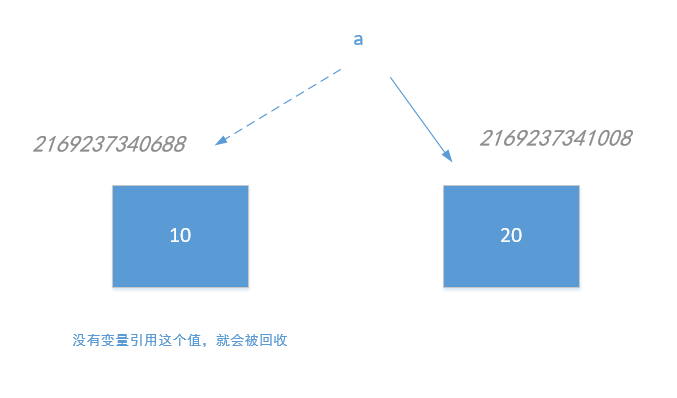

## 一、内容回顾

- 缩进

Python遵从缩进的书写风格，每层的缩进就是一个代码块：

```python
if condition {
    if condition {
        
    }
} else {
    
}

# 类似
if condition:
	if condition:
        pass
else:
   pass 
```

- pip和import

pip是从远程（pypi、清华镜像...）下载第三方包到本地，下载到site-packages目录下。

import就是在代码里面导入下载好的包。

## 二、运算符

- 算术运算符
- 赋值运算符
- 关系运算符
- 逻辑运算符
- 运算符的优先级

#### 1、算术运算符

| 运算符 | 运算       | 范例      | 结果 |
| ------ | ---------- | --------- | ---- |
| +      | 正号       | +8        | 8    |
| -      | 负号       | -8        | -8   |
| +      | 加号       | 8 + 9     | 17   |
| -      | 减号       | 9 - 8     | 1    |
| *      | 乘号       | 8 * 9     | 72   |
| /      | 除号       | 8 / 2     | 4    |
| %      | 取余       | 8 % 3     | 2    |
| //     | 整除       | 8 // 3    | 2    |
| +      | 字符串相加 | “x” + "y" | "xy" |
| **     | 指数       | 2**3      | 8    |

#### 2、赋值运算符  

| 运算符 | 描述                       | 范例                      |
| ------ | -------------------------- | ------------------------- |
| =      | 将一个表达式的值赋值给左值 | c = a + b                 |
| +=     | 相加后再赋值               | c += a 等同于 c = c + a   |
| -=     | 相减后再赋值               | c -= a 等同于 c = c - a   |
| *=     | 相乘后再赋值               | c *= a 等同于 c = c * a   |
| /=     | 相除后再赋值               | c /= a 等同于 c = c /a    |
| %=     | 取余后再赋值               | c %= a 等同于 c = c % a   |
| //=    | 整除后再赋值               | c //= a 等同于 c = c // a |

#### 3、关系运算符 

| 运算符 | 描述     | 范例   | 结果  |
| ------ | -------- | ------ | ----- |
| ==     | 相等于   | 5 == 3 | False |
| !=     | 不等于   | 5 != 3 | True  |
| <      | 小于     | 5 < 3  | False |
| >      | 大于     | 5 > 3  | True  |
| <=     | 小于等于 | 5 >= 3 | True  |
| >=     | 大于等于 | 5 <= 3 | False |

#### 4、逻辑运算符

| 运算符 | 描述                                                    | 范例                          |
| ------ | ------------------------------------------------------- | ----------------------------- |
| and    | 逻辑与运算符，如果两边都为True，结果为True；否则为False | A and B                       |
| or     | 逻辑或运算符，如果一边为True，结果为True；否则为False   | A or B                        |
| not    | 逻辑非运算符，如果条件为True，则为False，否则就为True   | not (A and B) 或者 !(A and B) |

#### 5、运算符的优先级

| 运算符                   | 说明               |
| ------------------------ | ------------------ |
| （）                     | 括号               |
| **                       | 指数运算符         |
| * / % //                 | 乘、除、取余、整除 |
| + -                      | 加、减             |
| == <= >= < >             | 关系运算符         |
| not and or               | 逻辑运算符         |
| = %= /= //= -= += *= **= | 赋值运算符         |

括号-->算术运算符-->关系运算符-->逻辑运算符-->赋值运算符

```powershell
>>> 5==3
False
>>> 6==7 or 3 > 2
>>> False or 3 > 2
True
>>> not (True and False)
True
>>> not True and False
False
>>> x = False or True
>>> x
True
>>> 2**3 and 6 - 6 + 7 == 6
>>> 8 and 7 == 6
>>> 8 and False
False
>>> 8 == False
False
>>> 8 == True
False
>>>

```

## 三、数据类型

### （一）分类

- Number（数字）
- String（字符串）
- List（列表）
- Tuple（元组）
- Set（集合）
- Dictionary（字典）

### （二）数字

#### 1、基础

数字类型包含：

- int（整型）
- float（浮点型）
- bool（布尔型）
- complex（复数）

```python
a = 10 # 整型
print(type(a)) # int

b = 10.2 # 浮点型
print(type(b)) # float

c = True # bool
d = False # bool
print(type(c), type(d))

e = 2 + 3j 
print(type(e)) # complex
```

数字之间是可以相互运算的，其中bool类型中的True相当于1，False相当于0.

```python
print(1 + 2)
print(3.6 - 1)
print(True + 1)  # True相当于数字1，False相当于数字0
print(False + 1)

print(True == 1)  # True
print(False == 0) # True
```

[官网](<https://docs.python.org/3/tutorial/introduction.html#numbers>)

#### 2、格式化输出

- 整数

```python
a = 10
print(a) # 整型
print("%d" % a) # 字符串
```

- 浮点型

```python
b = 1.2
print(b, type(b)) # 浮点型
print("%f" % b, type("%f" % b)) # 字符串
print("%.1f" % b) # 字符串
```

```python
# 最多保留16位小数，但是不会进行四舍五入
b = 1.2233523132533333755111122211122
print(b, type(b)) # 浮点型
print("%f" % b, type("%f" % b)) # 字符串
print("%.1f" % b) # 字符串
```

```python
>>> round(10.235)
10
>>> round(10.235, 2)
10.23

```

- 案例

从终端接收两个整数数，进行乘法计算：

```python
a = int(input("a="))
b = int(input("b="))

print("%d * %d = %d" % (a, b, a * b))
```

#### 3、类型转换

构造int、float、complex除了显式的创建外，还可以通过构造方法进行创建：<https://docs.python.org/zh-cn/3.10/library/stdtypes.html#typesnumeric>

```python
a = int("10")
print(a, type(a))

f = float("8")
print(f, type(f))

c = complex(2, 3)
print(c)
```

#### 4、案例

从终端获取一个三位数字，计算各个位的立方和，比如：327  3的三次方+2的三次方+7的三次方=？

```python
# 方法一
print("请输入一个三位数字:")
nummer = int(input())
a = int(nummer / 100)
b = int((nummer - 100 * a) / 10)
c = int((nummer - 100 * a - 10 * b))
res = a ** 3 + b ** 3 + c ** 3
print(res)

# 方法二
x = int(input("请输入一个三位数字:"))
a = x // 100 # 1
b = (x - a * 100) // 10
c = x % 10
res = a ** 3 + b ** 3 + c ** 3
print(res)
```

#### 5、内存模型

数字类型不可变的数据类型，不可以修改原有数据，只会创建新的数据。



### （三）字符串

- 字符串基础
- 字符串操作
- 字符串格式化
- 字符串主要方法
- 字符串其它方法

#### 1、字符串基础

##### 1.1 字符串定义

使用单引号、双引号、三引号包裹起来的字符。

```python
s1 = 'abc'
print(s1, type(s1))

s2 = "abc"
print(s2, type(s2))

# 三个成对的单引号'''abc'''
s3 = """abc"""
print(s3,type(s3))

"""
abc <class 'str'>
abc <class 'str'>
abc <class 'str'>
"""
```

三个引号保留原始信息，比如换行：

```python
s6 = """
     床头明月光，
     疑是地上霜。
"""
print(s6)
```

##### 1.2 转义字符

由反斜杠加上一个字符或者数字组成，它把反斜杠后面的字符或数字转成特定的意义。

| 转义字符 | 描述                   | 示例 |
| -------- | ---------------------- | ---- |
| \n       | 换行符                 |      |
| \r       | 回车，移到每一行的行首 |      |
| \b       | 退格                   |      |
| \t       | 制表符， tab键         |      |
| \x20     | 空格                   |      |
| \\\      | 反斜杠                 |      |
| \"       | 双引号                 |      |
| \'       | 单引号                 |      |

```python
# s1 = 'It's a pencil'
# 方法一
s1 = "It's a pencil"
print(s1)

# 方法二
s1 = """It's a pencil"""
print(s1)

# 方法三 转义字符
s1 = 'It\'s a pencil'
print(s1)
```

反斜杠有转义的效果，它把后面的单引号转成特定意义的引号。


