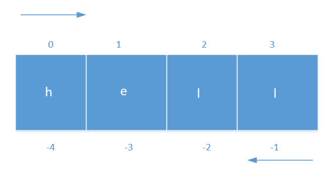

## 一、字符串

### （一）字符串基础

#### 1、拼接字符串

```py
import requests

s1 = "introduce:"
s2 = requests.get("https://www.baidu.com")
text = s2.text
res = s1 + text

print(s2, res)
```

除了通过“+”，也可以通过%s占位符进行拼接。

### （二）字符串基本操作

#### 1、索引

字符串可以通过索引取出每一个组成的字符：

```python
s1 = "hello"

print(s1[1], s1[4], type(s1[1]))  # 正向取值 str类型

print(s1[-1])  # 负向取值

print(s1[5]) # IndexError: string index out of range

```



#### 2、切片

语法：[start:end]

- start 子序列开始位置的索引
- end 子序列结束位置的索引

如果不提供start或者end，表示的start就是第一个位置，end就是最后一个位置

还有一种形式：[start\:end\:countBy]

默认的countBy是1

```python
s1 = "hello"

# 索引 + 拼接字符串
s2 = s1[0]
s3 = s1[1]
print(s2 + s3)
print("%s%s" % (s2, s3))

# 切片 左取右不取[) 正向取值
s5 = s1[0:2]
print(s5)

# 切片 右取左不取(] 负向取值
s6 = s1[-5:-3]
print("s6", s6)

# 切片 混合取值
s7 = s1[0:-3]
print("s7", s7)

# 步长切片 hell
s8 = s1[0:3:2]
print("s8", s8)

# 切片的其它情况
s9 = s1[::]  # 取所有的字符
print("s9", s9)
s10 = s1[1:]
print("s10", s10)

```

案例一：求逆串

给一个字符串，求它的逆串，如：hello，得到 olleh

```python
s = "hello"

print(s[::-1])
```

案例二：立方和

输入一个数字，求取各个位的平方和，比如：123，得到 1的平和+2的平方+3的平方

```python
s="123"
a=int(s[0])
b=int(s[1])
c=int(s[2])
res=a*a+b*b+c*c
print(res) 
```

#### 3、获取字符串的长度

使用了len这个内置函数进行计算的：

```python
>>> help(len)
Help on built-in function len in module builtins:

len(obj, /)
    Return the number of items in a container.
    
>>> len("abc")
3
```

#### 4、乘法

```python
s = "abc"

# abcabcabcabcabcabcabcabcabcabc
print(s * 10)
print(10)
```

#### 5、判断是否包含值

```python
s = "abc"

s1 = "a"

print(s1 in s)
print("ab" in s)

```

一般适用于条件语句

[源码](https://github.com/python/cpython)

### （三）字符串格式化

字符串格式化解决如果一个字符串中一部分是固定的，另一部分是动态变化的，那么就可以将固定的部分做成模板，动态的部分可以使用“%”进行代替，"%"后面的内容根据不同数据类型进行格式化参数。

> 例如：
>
> - %d 整数
> - %f 浮点数
> - %s 字符串
> - %% 显示百分号
>
> ...

格式化的方式：

- % 方式
- 模板字符串方式
- format方式

#### 1、 % 方式

```python
s = "hello %s"
print(s % "world")
```

#### 2、模板字符串

借助一个string模块，使用其中的Template类来完成。

```python
from string import Template

template = Template("$a-$a")
res = template.substitute(a="hello world")
print(res)
```

#### 3、format

字符串本身有一个format方法，用于格式化字符串，这个和之前的“%”不太一样，它使用的是{}，支持按顺序和关键字格式化字符串。

- 顺序格式化

```python
s1 = "{}-{}"
s2 = s1.format("hello","world")
print(s2)
```

- 关键字格式化

```python
s3 = "{a}:{b}"
print(s3.format(b="world", a="hello"))
```

- 混合格式化

```python
# 您好,世界,hello,world  先是顺序后是关键字
s5 = "{a}{},{b}{}"
print(s5.format("世界","world", a="您好", b="hello"))
```

记住第一种和第三种方式。

#### 4、format格式化案例

> 1 * 1 = 2

### （四）字符串主要方法

#### 1、center

用于将一个字符串在一定的宽度剧中显示，并且在字符串两侧填入指定的字符长度为1的字符串，默认是空格。

```python
s1 = "abc"

print(s1.center(30, "*"))
```

> 获得用户输入的一个数字，可能是整数，也可能是浮点数，计算它的三次方值，并且打印输出。
>
> 要求：
>
> - 输出结果采用宽度20个字符，剧中显示，其余字符用减号（-）填充
> - 比如 输入 10，
>
> ----1000---

```python
print("请输入数字")
nummer=input()
a=(int(nummer))**3
s=str(a) # s = "{}".format(a)
print(s.center(20,-)) 
```

因为anconda集成了jupyter notebook，所以可以方便代码的测试。

在一个新的目录下进入dos（cmd命令），运行如下的命令：

```powershell
E:\python-tutorial\Python-xiaoliu\2022.10.22\notebook>jupyter notebook
[I 17:11:03.753 NotebookApp] [jupyter_nbextensions_configurator] enabled 0.4.1
[I 17:11:05.170 NotebookApp] JupyterLab extension loaded from C:\ProgramData\Anaconda3\lib\site-packages\jupyterlab
[I 17:11:05.170 NotebookApp] JupyterLab application directory is C:\ProgramData\Anaconda3\share\jupyter\lab
[I 17:11:05.173 NotebookApp] Serving notebooks from local directory: E:\python-tutorial\Python-xiaoliu\2022.10.22\notebook
[I 17:11:05.174 NotebookApp] Jupyter Notebook 6.1.4 is running at:
[I 17:11:05.174 NotebookApp] http://localhost:8888/?token=0b68cc75a536700ccbbad1908f763dfe3b48c6ce83955e1d
[I 17:11:05.174 NotebookApp]  or http://127.0.0.1:8888/?token=0b68cc75a536700ccbbad1908f763dfe3b48c6ce83955e1d
[I 17:11:05.174 NotebookApp] Use Control-C to stop this server and shut down all kernels (twice to skip confirmation).
[C 17:11:05.349 NotebookApp]
...
```

然后拷贝对应的地址到浏览器：

```powershell
http://localhost:8888/?token=0b68cc75a536700ccbbad1908f763dfe3b48c6ce83955e1d
```

接着可以新建文件并且运行。

#### 2、find

用于在一个大的字符串中寻找一个子串，如果找到返回子串在大的字符串中出现的第一个位置，如果没找到，返回-1.

```python
s2 = "abcabc"

print(s2.find("bc"))  # 1
print(s2.find("bc", 2))  # 4
print(s2.find("bc", 2, 6))  # 4
print(s2.find("ac"))  # -1
```

find可以指定第二个和第三个参数，即：开始和结束位置。

#### 3、join

用于连接序列中的元素。

```python
# 字符串、列表，可迭代（可以循环）
s1 = "abc"
# for i in s1:
#     print(i)
# join 一般用于列表，把列表中的元素转成字符串
list1 = ['a', 'b', 'c'] # s = "a-b-c"
s = "-".join(list1)
print(s)
print(s1.join("def")) # 类似于拼接的效果
```

注意：连接的元素必须是字符串

#### 4、split

该方法与join方法互为逆方法，split是将一个字符串通过分隔符分成一个序列，如果不指定分隔符，默认的就是空格。

```python
s1 = "a-b-c"
print(s1.split())  # ['a-b-c']
print(s1.split("-"))  # ['a', 'b', 'c']
print(s1.split("-", 1))  # ['a', 'b-c']
```

>获得输入的一个字符串s，以字符“-”进行分隔s，并且将其中首尾通过“+”组合后输出。
>
>如：a-b-c-d-e-f
>
>输出：a+f
>
>列表中索引取值与字符串类似。

```python
s=input()
ss="-".join(s)
sss=ss.split("-")
print(sss[0],"+",sss[len(sss)-1]) 
```


