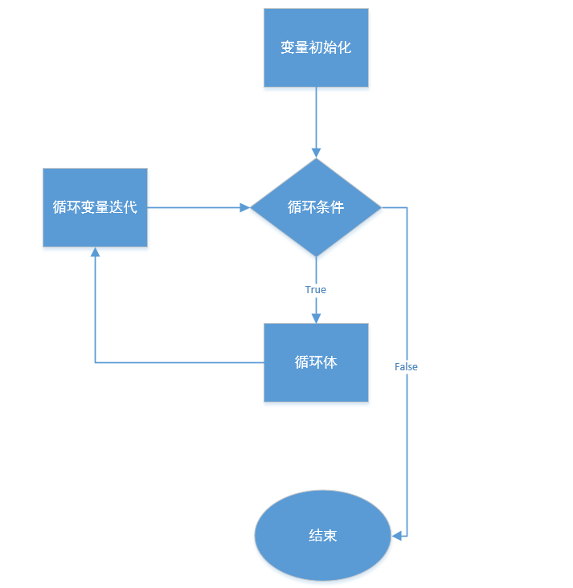

## 一、字符串

### （一）字符串基础

#### 1、拼接字符串

```py
import requests

s1 = "introduce:"
s2 = requests.get("https://www.baidu.com")
text = s2.text
res = s1 + text

print(s2, res)
```

除了通过“+”，也可以通过%s占位符进行拼接。

### （二）字符串基本操作

#### 1、索引

字符串可以通过索引取出每一个组成的字符：

```python
s1 = "hello"

print(s1[1], s1[4], type(s1[1]))  # 正向取值 str类型

print(s1[-1])  # 负向取值

print(s1[5]) # IndexError: string index out of range

```


#### 2、切片

语法：[start:end]

- start 子序列开始位置的索引
- end 子序列结束位置的索引

如果不提供start或者end，表示的start就是第一个位置，end就是最后一个位置

还有一种形式：[start\:end\:countBy]

默认的countBy是1

```python
s1 = "hello"

# 索引 + 拼接字符串
s2 = s1[0]
s3 = s1[1]
print(s2 + s3)
print("%s%s" % (s2, s3))

# 切片 左取右不取[) 正向取值
s5 = s1[0:2]
print(s5)

# 切片 右取左不取(] 负向取值
s6 = s1[-5:-3]
print("s6", s6)

# 切片 混合取值
s7 = s1[0:-3]
print("s7", s7)

# 步长切片 hell
s8 = s1[0:3:2]
print("s8", s8)

# 切片的其它情况
s9 = s1[::]  # 取所有的字符
print("s9", s9)
s10 = s1[1:]
print("s10", s10)

```

案例一：求逆串

给一个字符串，求它的逆串，如：hello，得到 olleh

```python
s = "hello"

print(s[::-1])
```

案例二：立方和

输入一个数字，求取各个位的平方和，比如：123，得到 1的平和+2的平方+3的平方

```python
s="123"
a=int(s[0])
b=int(s[1])
c=int(s[2])
res=a*a+b*b+c*c
print(res) 
```

#### 3、获取字符串的长度

使用了len这个内置函数进行计算的：

```python
>>> help(len)
Help on built-in function len in module builtins:

len(obj, /)
    Return the number of items in a container.
    
>>> len("abc")
3
```

#### 4、乘法

```python
s = "abc"

# abcabcabcabcabcabcabcabcabcabc
print(s * 10)
print(10)
```

#### 5、判断是否包含值

```python
s = "abc"

s1 = "a"

print(s1 in s)
print("ab" in s)

```

一般适用于条件语句

[源码](https://github.com/python/cpython)

### （三）字符串格式化

字符串格式化解决如果一个字符串中一部分是固定的，另一部分是动态变化的，那么就可以将固定的部分做成模板，动态的部分可以使用“%”进行代替，"%"后面的内容根据不同数据类型进行格式化参数。

> 例如：
>
> - %d 整数
> - %f 浮点数
> - %s 字符串
> - %% 显示百分号
>
> ...

格式化的方式：

- % 方式
- 模板字符串方式
- format方式

#### 1、 % 方式

```python
s = "hello %s"
print(s % "world")
```

#### 2、模板字符串

借助一个string模块，使用其中的Template类来完成。

```python
from string import Template

template = Template("$a-$a")
res = template.substitute(a="hello world")
print(res)
```

#### 3、format

字符串本身有一个format方法，用于格式化字符串，这个和之前的“%”不太一样，它使用的是{}，支持按顺序和关键字格式化字符串。

- 顺序格式化

```python
s1 = "{}-{}"
s2 = s1.format("hello","world")
print(s2)
```

- 关键字格式化

```python
s3 = "{a}:{b}"
print(s3.format(b="world", a="hello"))
```

- 混合格式化

```python
# 您好,世界,hello,world  先是顺序后是关键字
s5 = "{a}{},{b}{}"
print(s5.format("世界","world", a="您好", b="hello"))
```

记住第一种和第三种方式。

#### 4、format格式化案例

> 1 * 1 = 2

### （四）字符串主要方法

#### 1、center

用于将一个字符串在一定的宽度剧中显示，并且在字符串两侧填入指定的字符长度为1的字符串，默认是空格。

```python
s1 = "abc"

print(s1.center(30, "*"))
```

> 获得用户输入的一个数字，可能是整数，也可能是浮点数，计算它的三次方值，并且打印输出。
>
> 要求：
>
> - 输出结果采用宽度20个字符，剧中显示，其余字符用减号（-）填充
> - 比如 输入 10，
>
> ----1000---

```python
print("请输入数字")
nummer=input()
a=(int(nummer))**3
s=str(a) # s = "{}".format(a)
print(s.center(20,-)) 
```

上述只能处理整型，无法处理浮点型，int方法可以转化整型的字符串，无法处理浮点型的字符串。

```python
number = input("请输入整型或者浮点型数字：")
a = eval(number) ** 3
s = str(a)  # s = "{}".format(a)
print(s.center(20, "-"))
```

eval方法可以将字符串的原始形态显现出来，比如代码块字符串执行。

因为anconda集成了jupyter notebook，所以可以方便代码的测试。

在一个新的目录下进入dos（cmd命令），运行如下的命令：

```powershell
E:\python-tutorial\Python-xiaoliu\2022.10.22\notebook>jupyter notebook
[I 17:11:03.753 NotebookApp] [jupyter_nbextensions_configurator] enabled 0.4.1
[I 17:11:05.170 NotebookApp] JupyterLab extension loaded from C:\ProgramData\Anaconda3\lib\site-packages\jupyterlab
[I 17:11:05.170 NotebookApp] JupyterLab application directory is C:\ProgramData\Anaconda3\share\jupyter\lab
[I 17:11:05.173 NotebookApp] Serving notebooks from local directory: E:\python-tutorial\Python-xiaoliu\2022.10.22\notebook
[I 17:11:05.174 NotebookApp] Jupyter Notebook 6.1.4 is running at:
[I 17:11:05.174 NotebookApp] http://localhost:8888/?token=0b68cc75a536700ccbbad1908f763dfe3b48c6ce83955e1d
[I 17:11:05.174 NotebookApp]  or http://127.0.0.1:8888/?token=0b68cc75a536700ccbbad1908f763dfe3b48c6ce83955e1d
[I 17:11:05.174 NotebookApp] Use Control-C to stop this server and shut down all kernels (twice to skip confirmation).
[C 17:11:05.349 NotebookApp]
...
```

然后拷贝对应的地址到浏览器：

```powershell
http://localhost:8888/?token=0b68cc75a536700ccbbad1908f763dfe3b48c6ce83955e1d
```

接着可以新建文件并且运行。

#### 2、find

用于在一个大的字符串中寻找一个子串，如果找到返回子串在大的字符串中出现的第一个位置，如果没找到，返回-1.

```python
s2 = "abcabc"

print(s2.find("bc"))  # 1
print(s2.find("bc", 2))  # 4
print(s2.find("bc", 2, 6))  # 4
print(s2.find("ac"))  # -1
```

find可以指定第二个和第三个参数，即：开始和结束位置。

#### 3、join

用于连接序列中的元素。

```python
# 字符串、列表，可迭代（可以循环）
s1 = "abc"
# for i in s1:
#     print(i)
# join 一般用于列表，把列表中的元素转成字符串
list1 = ['a', 'b', 'c'] # s = "a-b-c"
s = "-".join(list1)
print(s)
print(s1.join("def")) # 类似于拼接的效果
```

注意：连接的元素必须是字符串

#### 4、split

该方法与join方法互为逆方法，split是将一个字符串通过分隔符分成一个序列，如果不指定分隔符，默认的就是空格。

```python
s1 = "a-b-c"
print(s1.split())  # ['a-b-c']
print(s1.split("-"))  # ['a', 'b', 'c']
print(s1.split("-", 1))  # ['a', 'b-c']
```

> 获得输入的一个字符串s，以字符“-”进行分隔s，并且将其中首尾通过“+”组合后输出。
>
> 如：a-b-c-d-e-f
>
> 输出：a+f
>
> 列表中索引取值与字符串类似。

```python
s=input()
ss="-".join(s)
sss=ss.split("-")
print(sss[0],"+",sss[len(sss)-1]) 
```

#### 5、lower、upper、capwords

- lower 将字符串中的所有大写字符转成小写
- upper 将字符串中所有的小写字符转成大写
- capwords 将字符串中每个单词的首字母转成大写

```python
# from string import capwords
import string

s = "I am a Student"

print(s.lower())
print(s.upper())
print(string.capwords(s))

"""
i am a student
I AM A STUDENT
I Am A Student
"""
```

#### 6、replace

用于将一个字符串中的子字符串替换成另外一个字符串，该方法有返回值，返回的时替换后的子字符串。

如果没有找到要替换的子字符就返回原字符串。

主要用于查找、替换

```python
s = "hello world hello world"

s1 = s.replace("world", "xiaoliu") # 默认替换全部
s2 = s.replace("world", "xiaoliu", 1)
print(s2)
```

```python
# 脱敏 *
password = "123456789"
text = "打架、斗殴、你好"

password = password.replace(password, "*********")
text = text.replace("打架、斗殴", "*****")
print(password)
print(text)
```

#### 7、strip

用于截取字符串的前后空格或者指定的字符

```python
s = "hello world"

# print(s.strip()) # 默认去掉前后空格
# print(s.strip("d")) # 去掉指定的字符
# print(s.strip("held")) # 默认只能去掉首、尾字母
print(s.strip("helad")) # o wor
```

注意：strip方法只能删除开头和结尾的字符，不能删除中间的字符

#### 8、count

统计字符串中的某个字符（子串）出现的次数

```python
s = "abcabcbcc"

print(s.count("bc"))
print(s.count("c", 3))
print(s.count("c", 3, 5))
```

#### 9、index

检测字符串中是否包含子字符串，如果包含返回开始的索引值，否则抛出异常，当然也是可以指定开始和结束索引的位置。

```python
s = "abcabcbcc"

print(s.index("bc")) # 1
print(s.index("bc", 3, 5)) # substring not found 左取右不取
```

#### 10、案例

```python
# 回文数
# 121 11211 2332
# 1231 不是回文数
# 接收一个输入的三位数， 判断其是否为回文数，比如：
# 输入 121
# 输出 yes/no

# 输入一个整数，判断其是否为回文数
# 1236321 双指针法
```

### （五）内存模型

字符串是不可变：

```python
>>> s = "abc"
>>> s[0]='d'
Traceback (most recent call last):
  File "<stdin>", line 1, in <module>
TypeError: 'str' object does not support item assignment
>>> s="'a',bb,'a'"
>>> s[0]
"'"
```

## 二、列表

- 列表基础
- 列表的基本操作
- 列表的基本方法
- 总结

### （一）列表的基础

#### 1、 创建列表

```python
# 方式一
list1 = [1, 2, 3]
list2 = ["a", "b", "c"]
list3 = [1, 2, "a"]
list4 = [1, 2, ["a", "b"]]

print(list1, type(list1))
print(list2)
print(list3)
print(list4)

# 方式二 传入序列即可
list5 = list("abc")
list6 = list([1,2,3])
print(list5)
print(list6)
```

#### 2、索引

列表中所有的元素都是有编号的，编号是从0开始的，这个编号是列表元素的索引，所有的元素都可以通过索引的方式进行访问。

```python
list1 = [1, 2, 3]

print(list1[0])
# print(list1[3]) # 不存在的索引 IndexError: list index out of range

print(list1[-1])
print(list1[-2])
print(list1[-3])
```

列表和字符串索引是一样的效果。

#### 3、分片

```python
list1 = [1, 2, 3]

# print(list1[0:2]) # 正向 左取右不取
# print(list1[-3:-1]) # 负向 左取右不取
# print(list1[0:-1]) # 混合 左取右不取

print(list1[:])
print(list1[1:])
print(list1[::2])
print(list1[::-1])
```

注意：分片是左取右不取，如果步长为负数，则相反。

#### 4、列表相加

列表相加是首尾相连，并不是元素的相加

```python
list1 = [1, 2, 3]
list2 = ["a", "b"]
print(list1 + list2) # [1, 2, 3, 'a', 'b']
```

#### 5、列表相乘

```python
list1 = [1, 2, 3]
list2 = ['a', "b"]

print(list1*2) # [1, 2, 3, 1, 2, 3]
```

#### 6、检查某个值是否属于列表

```python
list1 = [1, 2, 3]
list2 = ['a', "b"]

print(2 in list1)
```

#### 7、列表长度、最大值、最小值

三个内建函数：

- len
- max
- min

```python
list1 = [1, 2, 3]

print(len(list1))
print(max(list1))
print(min(list1))
```

#### 8、案例

要求输入年、月（1-12）、日（1-31），并且将月转化为中文输出，如：输入的月份是3，要求输出三月。

> 输入：2022 3 20
>
> 输出：2022年三月20日

```python
list1=["一","二","三"]
list3=input().split()
x=eval(list3[1])
print(list3[0]+"年"+list1[x-1]+"月"+list3[2]+"日")
```

### （二）列表的基本操作

#### 1、列表元素赋值

```python
list1 = [1, 2, 3]
# 索引取值
print(list1[0])

# 索引赋值、修改值
list1[0] = 2

print(list1)
```

#### 2、删除列表元素

```python
list1 = [1, 2, 3]

# 删除列表元素
del list1[0]

print(list1)
```

#### 3、分片赋值

分片赋值是将列表中的一部分元素通过分片获取，然后进行替换。

```python
# 分片方式
list2 = ['a', 'b', 'c', 'd', 'e']

# 增加元素
list2[1:1] = "m"
print(list2)

# 修改元素
# list2[2:] = [1, 2, 3]
# print(list2)
# list2[1:2] = 'f'
# print(list2)

# 删除元素
# list2[2:4] = []
# print(list2)
```

#### 4、列表的主要方法

```python
list1 = [1, 2, 3]

# append
# list1.append(5)
# print(list1)


# clear
# list1.clear()
# print(list1)

# copy
# list2 = list1.copy()
# print(list2)
# print(id(list1))
# print(id(list2))

# count
# num = list1.count(2)
# print(num)

# extend
# list3 = ['a', 'b']
# list1.extend(list3)
# print(list1)
# 通过切片、列表连接 l1 + l3 也可以实现extend效果

# index
# print(list1.index(1))
# print(list1.index(5))

# insert 分片也可
# list1.insert(1, 10)
# print(list1)

# pop有返回值，返回值就是被弹出的元素，默认移除最后一个元素，也可以通过索引移除指定的元素，知道元素位置有这个
# list1.pop()
# print(list1)
# res = list1.pop(1)
# print(list1)
# print(res)

# remove 移除指定的元素，知道元素值用这个
# res = list1.remove(1)
# print(res) # None 无返回值
# print(list1)
# print(list1.remove(5)) # ValueError: list.remove(x): x not in list

# reverse
# list1.reverse() # [::-1]
# print(list1)

# sort
# list1.sort(reverse=False)
# print(list1)
#
# def compare(item):
#
#     return item["age"]

#
# list5 = [{"username": "zhangsan", "age": 15},
#          {"username": "lisi", "age": 13},
#          {"username": "wuwang", "age": 27}]
# # print("list5", list5)
# list5.sort(key=compare) # [15,13,27]
# print(list5)

# sorted
print(sorted(list1))
print(sorted(list1, reverse=True))

```

注意：sort和sorted的区别，sort无返回值；sorted返回一个排好序的新列表，之前的列表保持不变。

#### 5、列表的其它方法

- enumerate

```python
list1 = [1, 2, 3]

res = list("123")
print(res)

print(list(enumerate(list1)))
```

- example

```python
nums = [2, 7, 11, 15]
target = 9


def twoSum(nums, target):
    hashmap = {}  # 字典
    for index, num in enumerate(nums):  # [(0,2),(1,7),(2,11),(3,15)]
        hashmap[num] = index  # hashmap = {2:0, 7:1, 11:2, 15:3}
    for i, num in enumerate(nums):  # [(0,2),(1,7),(2,11),(3,15)]
        j = hashmap.get(target - num)  # hashmap = {2:0, 7:1, 11:2, 15:3}
        if j is not None and i != j:  # i=0 j=1
            return [i, j]


res = twoSum(nums, target)
print(res)
```

#### 6、内存模型

列表是一种可变的、引用型的数据类型。

```python
>>> id(list1)
2048507264704
>>> list1[0]='a'
>>> id(list1)
2048507264704
```

本质是线性表的数据结构。比如：知道list[0]就可以通过firstValue + (n-m) * block = endValue

#### 7、案列

- copy（浅拷贝）、deepcopy（深拷贝）

```python
import copy

list1 = ["abc", 6, [1, 2, 3]]
list2 = list1.copy()
list3 = copy.deepcopy(list1)
print(list2)
print(list3)
"""
['abc', 6, [1, 2, 3]]
['abc', 6, [1, 2, 3]]
"""

list1[0] = 9
list1[2][0] = 10
print()
print(list2)
print(list3)
"""
['abc', 6, [10, 2, 3]]
['abc', 6, [1, 2, 3]]
"""
```


#### 8、数据类型的判断

```python
list1 = ["abc", 6, [1, 2, 3]]


class A:
    pass


class B(A):
    pass


b = B()

print(isinstance(b, A))
# "print('abc')"

# 判断一个列表是否有int类型
# for i in list1:
#     if isinstance(i, int):
#         print("包含整型", i)
#     elif isinstance(i, str):
#         print("包含字符串", i)

```

#### 9、总结

列表的增、删、改、查：

- 增加 extend、列表连接（+）、列表相乘、append、insert、分片
- 删除 pop、分片、remove、del、clear
- 修改 分片、索引
- 查询 索引、enumerate 

#### 10、图书馆管理系统

- 注册
- 登陆
- 权限校验（装饰器）
- 图书增、删、查、改
- 预定图书（向系统后台发送预定消息）
- 图书上架后推送消息（邮件、电话发消息...）

...

## 三、字典

### （一）引出

```python
"""
student (name age gender)
"""
ll_name = ["zhangsan", "lisi"]
ll_age = [20, 21]
ll_gender = ["male", "male"]

print("姓名：%s, 性别：%s, 年龄：%s" % (ll_name[0], ll_gender[0], ll_age[0]))

"""
上面的方式，资源的消耗更大
"""
student1 = {"name": "zhangsan", "gender": "male", "age": 20}
student2 = {"name": "lisi", "gender": "male", "age": 21}

student_list = [student1, student2]
print("第一个学生 姓名：%s, 性别：%s, 年龄：%s" % (student_list[0]["name"],student_list[0]["gender"],student_list[0]["age"]))
print(student_list[0])
```

- 字典基础
- 字典的基本操作
- 字典方法
- 字典总结

### （二）字典基础

#### 1、创建字典

一个字典通过一对大括号进行创建，键值对方式（:），每一对键值对之间通过“,”分隔，如果大括号里面无任何东西就是空字典，它是Python中唯一具备映射关系的数据类型，效率高于列表。

- 直接通过大括号创建

```python
# 方式一

d = {}
print(type(d))  # <class 'dict'>
d = {"name": "zhangsan"}
print(d)
```

- 通过dict内置函数创建

```python
# 方式二
d1 = dict()
print(type(d1))  # <class 'dict'>
"""
        dict(iterable) -> new dictionary initialized as if via:
            d = {}
            for k, v in iterable:
                d[k] = v
"""

d2 = dict([["k1", "v1"], ["k2", "v2"]])
print(d2)  # {'k1': 'v1', 'k2': 'v2'}
```

注意：字典的key是唯一的，不能重复的。

```python
# 字典的key是唯一的, 不会抛出异常，但是相同的键会被覆盖
d3 = {"name": "zhangsan", "name": "lisi"}
print(d3["name"]) # lisi
```

#### 2、字典的基本操作

- dict[key]

包含增、查、改操作：

```python
d1 = {"name": "harry", "age": 20, "hobby": ["books", "pingpong"]}
# d2 = {}


# 增加键值对
# d1["addr"] = "German"
# print(d1)

# 修改值，键是必须存在的，假如不存在相当于增加键值对
# d1["age"] = 22
# print(d1)
# d1["xx"] = "xx"
# print(d1)

# 查询，这种通过dict[key]查询的话，如果key不存在就会报 KeyError 错误
# print(d1["age"])  # 22
# print(d1["mm"]) # KeyError: 'mm'
```

- del dict[key]

删除键值对

```python
d1 = {"name": "harry", "age": 20, "hobby": ["books", "pingpong"]}
# 删除键值对 del dict[key]
print(d1)
del d1["name"]
print(d1)
```

- key in dict

预防KeyError错误

```python
d1 = {"name": "harry", "age": 20, "hobby": ["books", "pingpong"]}
# key in dict
"""
if condition:
    pass
elif condition:
    pass
else:
    pass
"""
if "mm" in d1:
    del d1["mm"]
else:
    print("key不存在")
print(d1)
```

- len(dict)

字典的长度

```python
d1 = {"name": "harry", "age": 20, "hobby": ["books", "pingpong"]}
print(len(d1))
```

- 字典格式化字符串

> 1、%系列
>
> 2、format 占位符 {}
>
> 3、string.Template
>
> 4、format_map

```python
# 1、数据
data = {
    "name": "zhansan",
    "age": 20,
    "gender": "male"
}

# 2、定义一个模板
str1 = "{name}-{age}-{gender}"

# 3、把数据渲染到模板上
print(str1.format_map(data))
```

### （三）字典方法

#### 1、clear

清空字典中的元素

```python
d1 = {"name": "harry", "age": 20, "hobby": ["books", "pingpong"]}

# clear
# d1.clear()
# print(d1)
```

#### 2、copy与deepcopy

```python
d1 = {"name": "harry", "age": 20, "hobby": ["books", "pingpong"]}

# copy 与 deepcopy
import copy
d2 = d1.copy()
d1["age"] = 21
print("d1", d1)
print("d2", d2)
"""
d1 {'name': 'harry', 'age': 21, 'hobby': ['books', 'pingpong']}
d2 {'name': 'harry', 'age': 20, 'hobby': ['books', 'pingpong']}
"""

d1["hobby"][0] = "fish"
print("d1", d1)
print("d2", d2)
"""
d1 {'name': 'harry', 'age': 21, 'hobby': ['fish', 'pingpong']}
d2 {'name': 'harry', 'age': 20, 'hobby': ['fish', 'pingpong']}
"""

```

拷贝字典浅拷贝只拷贝第一层（非引用数据类型）


#### 3、fromkeys

用于根据key建立新的字典，返回值就是新的字典，在新的字典中所有的key都有相同的默认值None，不过可以根据fromkeys方法的第二个参数进行指定默认值。

```python
# fromkeys
d2 = {}
d3 = d2.fromkeys(["name", "age", "hobby"]) 
print(d3)# {'name': None, 'age': None, 'hobby': None}
d4 = d2.fromkeys(["name", "age", "hobby"], "xx")
print(d4) # {'name': 'xx', 'age': 'xx', 'hobby': 'xx'}
```

#### 4、get

get方法不会报KeyError错误，会返回None值，也可指定默认返回值。

```python
d1 = {"name": "harry", "age": 20, "hobby": ["books", "pingpong"]}

# get 取值
print(d1.get("name")) # d1["name"]
print(d1.get("mm"))
print(d1.get("mm", "harry")) # 如果key不存在可以指定默认值
```

#### 5、keys /values/ items

```python
d1 = {"name": "harry", "age": 20, "hobby": ["books", "pingpong"]}

print(d1.keys())
print(d1.values())
print(d1.items())
"""
dict_keys(['name', 'age', 'hobby'])
dict_values(['harry', 20, ['books', 'pingpong']])
dict_items([('name', 'harry'), ('age', 20), ('hobby', ['books', 'pingpong'])])
"""
```

#### 6、pop/popitem

都用于弹出字典中的元素，pop方法用于获取指定key的值，并且从字典中返回key-value，popitem返回最后一个key-value.

```python
d1 = {"name": "harry", "age": 20, "hobby": ["books", "pingpong"]}

res = d1.pop("name")
print(res) # harry
print(d1) # {'age': 20, 'hobby': ['books', 'pingpong']}

res1 = d1.popitem()
print(res1) # ('hobby', ['books', 'pingpong'])
print(d1) # {'name': 'harry', 'age': 20}
```

#### 4、setdefault

设置key的默认值，该方法接收两个参数，第一个是key，第二个就是默认值，如果key在字典中不存在，那么就会向字典中添加key，并且用第二个默认值作为value；如果key存在，这个方法不会修改key原来的值，而且该方法会返回原来的值。

```python
d3 = {}
res2 = d3.setdefault("name", "weiwei")
print(res2)
print(d3)
"""
weiwei
{'name': 'weiwei'}
"""

res = d3.setdefault("name", "huihui")
print(res)
print(d3)
"""
weiwei
{'name': 'weiwei'}
"""
```

#### 5、update

用于一个字典中的元素更新另外一个字典，该方法接收一个参数，该参数表示用于更新数据的字典的数据源。

```python
d1 = {"name": "harry", "age": 20, "hobby": ["books", "pingpong"]}

d2 = {"addr": "german"}
d3 = {"name": "weiwei"}

d1.update(d2)  # 类似与列表中的extend
print(d1)  # {'name': 'harry', 'age': 20, 'hobby': ['books', 'pingpong'], 'addr': 'german'}

d1.update(d3)
print(d1)  # {'name': 'weiwei', 'age': 20, 'hobby': ['books', 'pingpong'], 'addr': 'german'}

```

如果d2中键值对在d1中不存在，就会添加到d1；如果已经存在会进行覆盖更新。

还有另外一种方法：

```python
d1 = {"name": "harry", "age": 20, "hobby": ["books", "pingpong"]}

d2 = {"addr": "german"}

d5 = dict(d1, **d2)  # {'name': 'harry', 'age': 20, 'hobby': ['books', 'pingpong'], 'addr': 'german'}
print(d5)
```

### （四）方法总结

字典的操作无非就是增、删、查、改基本操作，下面总结一下：

- 增加 dict[key] / dict.setdefault()
- 删除 del dict[key] / dict.pop() / dict.popitem()
- 查询 dict[key] / dict.get()
- 更新 dict[key] / dict.update() / dict(dict1, **dict2) 

### （五）字典的原理

#### 1、内存模型

字典是引用类型，是可变的，是可以任意的添加键值对。

```python
Type "help", "copyright", "credits" or "license" for more information.
>>> d = {}
>>> id(d)
1275730754112
>>> d["name"] = "zhangsan"
>>> id(d)
1275730754112
>>>
```

#### 2、字典是无序的

在Python3.6之后，字典是有序的，之前是无序的。

```python
(py3.5Env) C:\Users\shenjianping>python
Python 3.5.5 | packaged by conda-forge | (default, Jul 24 2018, 01:52:17) [MSC v.1900 64 bit (AMD64)] on win32
Type "help", "copyright", "credits" or "license" for more information.
>>> d = {}
>>> d["name"] = "zhangsan"
>>> d
{'name': 'zhangsan'}
>>> d["age"] = 20
>>> print(d)
{'name': 'zhangsan', 'age': 20}
>>> d["gender"] = "male"
>>> d
{'name': 'zhangsan', 'age': 20, 'gender': 'male'}
>>> d["1"] = 20
>>> d["2"] = 20
>>> d["3"] = 20
>>> d
{'3': 20, 'gender': 'male', 'age': 20, '1': 20, '2': 20, 'name': 'zhangsan'}
>>>
```

使用有序字典这个模块实现：

```python
from collections import OrderedDict

d = OrderedDict()
print(d, type(d))

d["1"] = 20
d["2"] = 20
d["3"] = 20
```

#### 3、字典的键是不可变的

```python
dict1 = {"k1": "v1", "k2": "v2", ["k3", "k4", "k5"]: "v3"} 
print(dict1) # TypeError: unhashable type: 'list'
```

字典的键是不可变的，为什么？这与字典底层的存取有关，字典的底层使用是是哈希表。

假如一个列表是这样的：

```python
list1 = [1, 2, 3, 4, 5, 6] # 像查找5这个元素的位置
```

一般情况下通过循环最多遍历一个列表的长度。

字典是如何实现存取的：

```python
d1 = {1: "a", 2: "b", 3:"c"}
```

序列（用[]包裹起来的）是基本的数据结构，字典也是基于它来构造的。

序列指的是一块可存放多个值的连续内存空间，这些值按照一定的顺序排列，可以通过每个值所在位置的编号（索引）访问它们。

```python
1 % 3 = 1
2 % 3 = 2
3 % 3 = 0
```


什么是哈希表？

哈希表是基于键、值对存储的数据结构，底层一般采用的是列表（数组）。

基于键计算下标这个过程就是哈希函数的过程。

哈希函数：提供把关键字映射到列表中的位置算法，是哈希表存储数据的核心。

如果key是字符串，可以自己设计算法，也可以通过hash内置函数实现：

```python
d1 = {"ab": 1, "bcd": 2, "ca": 3}


a = 1
b = 2
c = 3
d = 4
"""
ab = 3
bcd = 9
ca = 4
"""
# 之后 %

print(hash("abc")) # 1503378533357126798

```

实例：

```python
def hash_code(key):
    a = 1
    b = 2
    c = 3
    if key == 'ab':
        res = a + b
    elif key == 'bc':
        res = b + c
    else:
        res = a + c
    return res % 3


hash_table = [None] * 3
print(hash_table)

"""
"ab": 1, "bc": 2, "ca": 3
"""
idx = hash_code("ab")
hash_table[idx] = 1
print(hash_table)
idx = hash_code("bc")
hash_table[idx] = 2
print(hash_table)
idx = hash_code("ca")
hash_table[idx] = 3
print(hash_table)

```

hash的过程是不可变的，因为下标的位置不能变动，否则取值不正确。

## 四、元组

- 元组创建
- 元组操作

### （一）元组创建

- 直接使用圆括号、逗号

```python
# 第一种创建方式
t1 = (1, 2, 3, 4, 5)
print(type(t1)) # <class 'tuple'>
```

- 关键字tuple创建

```python
# 第二种创建方式
t2 = tuple([1,2,3])
print(t2)
```

注意：如果元组中只有一个元素，一定要带上逗号

```python
# 注意
t3 = (5)
print(type(t3)) # <class 'int'>
t4 = (5,)
print(type(t4)) # <class 'tuple'>
```

### （二）元组操作 

元组也是一种序列，序列所有的特性，元组都具备，那么有哪些序列特性呢？

- 索引取值
- 分片
- 序列相加
- 序列相乘
- in 运算
- 序列的内建函数

```python
t1 = (1, 2, 3, 4, 5)

# 索引、切片取值
print(t1[0])  # 1
print(t1[1:3])  # 2, 3

# 元组相加
t2 = ("hello",)
print(t1 + t2)  # (1, 2, 3, 4, 5, 'hello')

# 元组相乘
print(t1 * 2)  # (1, 2, 3, 4, 5, 1, 2, 3, 4, 5)

# in 运算
print(1 in t1)

# 内建函数
print(len(t1))
print(max(t1))
print(min(t1))
```

元组还存在2个基本方法：

```python
    def count(self, *args, **kwargs): # real signature unknown
        """ Return number of occurrences of value. """
        pass

    def index(self, *args, **kwargs): # real signature unknown
        """
        Return first index of value.
        
        Raises ValueError if the value is not present.
        """
        pass
```

### （三）深入理解元组

#### 1、元组是不可变的类型

```python
>>> t1 = (1,2,3)
>>> t1[0] = 5
Traceback (most recent call last):
  File "<stdin>", line 1, in <module>
TypeError: 'tuple' object does not support item assignment
>>>
```

可以理解成添加一个元素后，不是之前的元组了。

```python
>>> t1 = (1,2,3)
>>> t2 = (4,)
>>> t1 + t2
(1, 2, 3, 4)
>>> t3 = t1 + t2
>>> id(t1)
2754161596456
>>> id(t3)
2754161599656
>>>
```

#### 2、元组性能由于列表

```python
>>> list1 = [1,2,3]
>>> t1 = (1,2,3)
>>> list1.__sizeof__()
64
>>> t1.__sizeof__()
48
>>>
```

列表的元数据（如：现在存在多少个元素等必要信息），方便扩容；元组在创建后就不可变了，所以资源消耗的更少。

元组是静态的，列表是动态的，在Python中静态变量会暂时缓存空间大小，如果下次创建一个一样的大小元组，直接拿来使用，列表是动态的，如果没有变量使用它，就会直接被回收，以便于其它变量使用。

```python
import timeit

print(timeit.timeit("list1 = [1,2,3]")) # 0.049630199995590374
print(timeit.timeit("t1 = (1,2,3)")) # 0.012114499986637384
```

#### 3、总结

- 元组和列表底层使用的都是线性表的结构
- 元组比列表访问和处理速度快，如果只是访问而非修改，建议使用元组
- 列表是动态的，是可变的
- 元组是静态的，是不可变的，一旦创建不能修改
- 列表不能作为字典的键，元组可以

## 五、集合

- 集合基础
- 集合方法
- 集合常用方法
- 集合与函数

### （一）集合基础

#### 1、创建集合

- 使用{}

```python
# 第一种，注意里面需要初始化元素，判断是字典还是集合
s = {1,}
print(s, type(s)) # <class 'set'>
```

- 使用set类

```python
# set类来创建
s1 = set()
print(s1, type(s1)) # <class 'set'>

s2 = set([1,2,3]) # set((1,2,3))
print(s2) # {1, 2, 3}
```

#### 2、集合特性

- 无序性

集合中的值是平等的，元素之间是无序的，无法通过索引和分片进行操作。

- 互异性

集合中的任意两个元素之间是不同的，即每个元素只能出现一次，常常用于去重

```python
list1 = [i for i in range(10)]
print(list1)

list1.extend([j for j in range(5)])

print(list1)

print(set(list1), len(set(list1)))
```

- 确定性

集合内的元素是不可变的数据类型，列如，集合、列表、字典都不能作为集合的元素。

#### 3、集合的本质

集合的本质和字典是一样的，它的底层也是使用哈希表承载的。哈希表是存储键值对，但是集合把value省略了，只剩下键，所以确定性就是键不可变，无序性也就不能使用索引和切片。互异性也就是键不能重复。

#### 4、in 元素检测

判断一个元素是否属于集合：

```python
s = set("hello")
print("h" in s) # True
```

### （二）集合的方法

#### 1、add

向集合中添加一个元素

```python
s1 = {1, 2, 3}
s1.add(4)
print(s1) # {1, 2, 3, 4}
```

#### 2、clear

从集合中移除所有的元素

```python
s1 = {1, 2, 3}
s1.clear()
print(s1) # set()
```

#### 3、copy

返回集合的浅拷贝

```python
s1 = {1, 2, 3}
print(s1)
s2 = s1.copy()
print(s2)
```

#### 4、difference

将两个或多个集合的差集作为一个新集合返回

```python
s1 = {1, 2, 3}
s2 = {1, 2}
s3 = s1.difference(s2)
print(s3)  # {3}
```

#### 5、difference_update

从这个集合中删除另一个集合中所有的元素

```python
# 效果等同于s1-s2，但是是操作原集合，无返回值
s1 = {1, 2, 3}
s2 = {1, 2}
s1.difference_update(s2)
print(s1)
```

#### 6、discard

移除一个已经存在于集合中的元素（如果元素不存在，则不执行任何操作）

```python
s1 = {1, 2, 3}
s1.discard(1)
print(s1)
```

#### 7、intersection

将两个集合的交集作为一个新集合返回

```python
s1 = {1, 2, 3}
s2 = {1, 2}
s3 = s1.intersection(s2)
print(s3)
```

#### 8、intersection_update

自身集合和另一个集合的交集来更新自身集合

```python
s1 = {1, 2, 3}
s2 = {1, 2}
s1.intersection_update(s2)
print(s1)
```

#### 9、isdisjoint

如果两个集合有一个空交集，返回True

```python
s1 = {1, 2, 3}
s2 = {1, 2}
flag = s1.isdisjoint(s2)
print(flag) # False
```

#### 10、issubset

如果另一个集合包含这个集合，返回True

```python
s1 = {1, 2, 3}
s2 = {1, 2}
flag = s2.issubset(s1)
print(s2.issubset(s1)) # True
```

#### 11、issuperset

如果这个集合包含另一个集合，返回True

```python
s1 = {1, 2, 3}
s2 = {1, 2}
print(s1.issuperset(s2)) # True
```

#### 12、pop

删除并返回任意一个集合元素（如果集合为空，会抛出KeyError的错误）

```python
s1 = {1, 2, 3}
print(s1.pop()) # 1
print(s1) # {2, 3}
```

#### 13、remove

删除集合中指定的一个元素（如果元素不存在，会抛出KeyError的错误）

```python
s1 = {1, 2, 3}
print(s1.remove(2)) # None
print(s1) # {1, 3}
```

#### 14、symmetric_difference

将两个集合的对称差作为一个集合返回（删除两个集合相同的部分，其余保留）

```python
s1 = {1, 2, 3}
s2 = {1, 2}
print(s1.symmetric_difference(s2))
```

#### 15、symmetric_difference_update

用自己和另一个集合的对称差来更新这个集合

```python
s1 = {1, 2, 3}
s2 = {1, 2, 4}
s1.symmetric_difference_update(s2)
print(s1) # {3, 4}
```

#### 16、union

将集合的并集作为一个新集合返回

```python
s1 = {1, 2, 3}
s2 = {1, 2}
print(s1.union(s2))
```

#### 17、update

用自己和另一个集合的并集来更新这个集合

```python
s1 = {1, 2, 3}
s2 = {1, 2}
s1.update(s2)
print(s1)
```

### （三）集合的常用方法

#### 1、并集

使用union方法或者操作符 “|”进行两个或者多个集合合并

```python
s1 = {1, 2, 3}
s2 = {5, 6, 7}

print(s1.union(s2))
print(s1 | s2)

```

#### 2、交集

使用intersection方法或者操作符“&”进行两个或者多个集合求交集

```python
s1 = {1, 2, 3}
s2 = {2, 6, 7}

print(s1.intersection(s2))
print(s1 & s2)
```

#### 3、差集

使用difference方法或者操作符“-”进行两个或者多个集合求差集

```python
s1 = {1, 2, 3}
s2 = {2, 6, 7}

print(s1.difference(s2))
print(s1 - s2)
```

#### 4、对称差集

使用symmetric_difference方法或者操作符“^”进行两个或者多个集合求对称差集

```python
s1 = {1, 2, 3}
s2 = {2, 6, 7}

print(s1.symmetric_difference(s2))
print(s1 ^ s2)
```

#### 5、子集

使用issubset方法或者操作符“<”判断当前集合是否是另一个集合的子集

```python
s1 = {1, 2, 3}
s2 = {2}

print(s2.issubset(s1))
print(s2 < s1)
```

### （四）集合与函数

#### 1、len

获取集合的长度

```python
s = {1,2,3}
print(len(s))
```

#### 2、max

获取集合中最大的元素

```python
s = {1,2,3}
print(max(s))
```

#### 3、min

获取集合中最小元素

```python
s = {1,2,3}
print(min(s))
```

#### 4、sum

返回集合中所有元素之和

```python
s = {1,2,3}
print(sum(s))
```

#### 5、sorted

返回排序后的集合列表

```python
s = {1,2,3}
print(sorted(s))
```

#### 6、enumerate

返回一个可以迭代的enumerate数据类型，迭代后可以取出索引值和具体值

```python
s = {1,2,3}

print(enumerate(s)) # 返回一个可以迭代的enumerate数据类型
for index, value in enumerate(s): # 迭代后可以取出索引值和具体值
    print(index, value)
```

#### 7、all

如果集合中的所有元素都为True（或者集合为空），则返回True

```python
s1 = {True, True, True}
print(all(s1))

s3 = {0, 1, 2}
print(all(s3))

s2 = set()
print(all(s2))
```

#### 8、any

如果集合中的任意元素为True，则返回True；如果集合为空，则返回False

```python
s2 = set()
s = {1, 1, 0}
print(any(s2))
```

## 六、案例

有一段英文：

>this is mY PEN

里面有些大小写混合，现在要求：

- 将每一个单词的因为首字母大写，其余小写
- 统计这里面一共有多少个不同的英文字母
- 并且取出字母数量top2的英文字母

>for 循环使用语法：
>
>for i in list:
>
>​     print(i)
>
>if条件语句语法：
>
>if <condition>:
>
>​	pass
>
>else:
>
>​	pass
>
>

```python
str1="this is mY PEN"
print(str1.title())

list1=str1.split()
str2="".join(list1)
print(str2)
set1=set(str2)
print(set1,len(set1))


# 第一步完成字典的数据结构 字母:数量
str1 = "this is mY PEN"
str2 = str1.replace(" ", "")
print(str2)
d1 = {}
# for i in str2:
#     d1[i] = d1.get(i, 0) + 1
# print(d1.items())

# for i in str2:
#     d1.setdefault(i, 0) # {"i":0} 第二次 i {"i": 1}
#     d1[i] += 1 # 0 + 1 = 1 {"i": 1}

for i in str2:
    if d1.get(i) is None: # None
        d1[i] = 0 # {"i":0}
    d1[i] += 1 # {"i":1}

def sort_value(x):
    return x[1]


order_d1 = sorted(d1.items(), key=sort_value, reverse=True)
print(order_d1[0:2])
```

## 七、数据类型总结

- 种类
- 是否可变
- 是否有序

### （一）种类

- 数字
- 字符串
- 列表
- 字典
- 元组
- 集合

### （二）是否可变

| 是否可变 | 数据类型           |
| -------- | ------------------ |
| 可变     | 列表、字典、集合   |
| 不可变   | 数字、字符串、元组 |

### （三）是否有序

| 有、无序 | 数据类型   |
| -------- | ---------- |
| 有序     | 列表、元组 |
| 无序     | 字典、集合 |

## 八、流程控制

- 顺序控制
- 分支控制
- 循环控制

### （一）顺序控制

是最简单的一种流程控制，强调代码从上到下依次执行，中间没有任何顺序和跳转

```python
a = 10
b = 20
print(a)
print(b)
```

### （二）分支控制

#### 1、单分支

- 基本语法

>if <condition>: # 冒号结尾
>
>​	pass
>
>

```python
a = 10
if a > 5:
    pass # 占位符，防止语法报错，不做任何事情

if a > 5:
    print("a=", a)
```

#### 2、双分支

- 基本语法

>if <condition>:
>
>​	pass
>
>else:
>
>​	pass

```python
a = 7

if a > 5:
    print("a大于5")
else:
    print("a小于等于5")
```

双分支中满足一个条件，就不会执行其它条件的语句。

#### 3、多分支

- 基本语法

>if <condition>:
>
>​	pass
>
>elif <condition>:
>
>​	pass
>
>elif <condition>:
>
>​	pass
>
>else:
>
>​	pass

```python
a = 17

if a > 5 and a < 10:
    print("a大于5并且a小于10")
elif a >= 10 and a < 15:
    print("a大于等于10并且a小于15")
elif a >= 15 and a < 20:
    print("a大于等于15并且a小于20")
else:
    print("a大于等于20")

```

多分支满足一个条件，就不会执行其它条件的语句。

#### 4、嵌套分支

在一个分支结构中嵌套另一个分支结构，里面的分支结构被称为内层分支，外面的分支结构被称为外层分支。

- 基本语法

>if <condition>:
>
>​	if <condition>:
>
>​		pass
>
>​	else:
>
>​		pass

```python
a = 5
b = 10

if a >= 5:
    if b < 8:
        print("小于8")
    else:
        print("b大于等于8")
else:
    print("a小于5")
```

#### 5、条件变量

| 类型   | 用例                      |
| ------ | ------------------------- |
| 数字   | 0表示False，1表示True     |
| 字符串 | 空字符串（""），表示False |
| 对象   | None表示False             |
| 布尔   | True或者False             |

```python
a = 0

if a:
    print("0")
else:
    print("1")

b = ""

if b:
    print("0")
else:
    print("1")

c = None
if c:
    print("0")
else:
    print("1")

d = True
if d:
    print("0")
else:
    print("1")
```

用的比较多的是对象和布尔进行判断，尽量以bool显式判断。

### （三）案例

#### 1、计算器

从控制台输入2个数字以及运算符，输出执行的结果（四则运算）。

> 输入：1 2 +
>
> 输出：3

```python
print("输入两个数字做运算")
a = int(input())
b = int(input())


def rechener(a, b):
    print("输入需要的运算法则（+,-,*,/）")
    x = input()

    if "+" == x:
        res = a + b
        return res
    elif "-" == x:
        res = a - b
        return res
    elif "*" == x:
        res = a * b
        return res
    else:
        res = a / b
        return res


res = rechener(a, b)
print(res)

```

### （四）循环控制

- while循环
- for循环

Python中没有do...while循环，用其它的方式可以实现这种效果。

循环控制流程图：



#### 1、while循环

- 基本语法

> while <循环条件>：
>
> ​	循环体
>
> ​	循环变量迭代

- 示例

实现1-100求和

```python
i = 1
sum = 0
while i <= 100:
       sum += i  # sum = sum + i
       i += 1
print(sum, i) # 5050 101
```

如果需要一个死循环，可以这样完成：

```python
while True:
    pass
```

#### 2、for循环

- 基本语法

>for 可迭代变量 in 序列：
>
>​	循环体

- 示例

实现1-100求和

```python
sum = 0
for i in range(101):  # i表示的是每一个元素
    sum += i

print(sum)
```

#### 3、嵌套循环

将一个循环放到另一个循环内，这样就形成了嵌套循环。外边的循环被称为外层循环，里面的循环被称为内层循环。实际上嵌套循环的循环体是内层循环。

```python

for i in [1,2,3]:
    for j in [1,2,3]:
        print(i, j)
"""
1 1
1 2
1 3
2 1
2 2
2 3
3 1
3 2
3 3
"""
```

嵌套循环中外层循环每一次循环就会是内层循环完全走完一遍。

#### 4、break/continue

##### 4.1 break

用于终止代码块的执行，可以跳出循环语句。

- while循环

```python
i = 0

while True:
    print(i)
    if i > 10:
        break
    i += 1
```

- for循环

```python

for i in range(10):
    print(i)
    if i > 5:
        break
```

- 嵌套循环

```python
for i in range(3):
    for j in range(3):
        print("内层",i, j)
        if j >= 2:
            break
    print("外层",i)
"""
"内层" 0 0
"内层" 0 1
"内层" 0 2
"外层" 0

"内层" 1 0
"内层" 1 1
"内层" 1 2
"外层" 1

...
"""

for i in range(3):
    for j in range(3):
        print("内层",i, j)
        if j >= 2:
            break
    print("外层",i)
    if i >= 1:
        break
"""
"内层" 0 0
"内层" 0 1
"内层" 0 2
"外层" 0

"内层" 1 0
"内层" 1 1
"内层" 1 2
"外层" 1
"""
```

#### 4.2 continue

跳出本次循环，后面的循环还会接着运行

```python
for i in range(10):
    if i >= 5:
        continue
    print(i)  # i i >= 5 这行代码就不会被执行
```

### （五）案例

#### 1、求1-100能被3整除的数之和

```python
sum=0
for i in range(101):
    if i % 3 == 0:
        sum=sum+i
print(sum)
```

## 九、实战演练

### （一）学生信息管理系统

>1、显示菜单的功能
>
>2、用户输入功能序号
>
>3、添加学生信息
>
>- 如果已经存在，请提示勿要重复添加
>
>4、删除学生信息
>
>- 如果没有该学生，请提示不存在该学生
>
>5、修改学生信息
>
>- 如果没有该学生，请提示不存在该学生
>
>6、查询学生信息
>
>- 如果没有该学生，请提示不存在该学生
>
>7、显示所有学生信息
>
>8、退出当前系统
>
>- 通过yes/no进行确认

### （二）菜单树

```python
data = [
    {"id":1, "pid":None, "title": "文档"},
    {"id":2, "pid":None, "title": "引导页"},
    {"id":3, "pid":None, "title": "权限测试页"},
    {"id":4, "pid": None, "title": "组件"},
    {"id":5, "pid":3, "title": "页面权限"},
    {"id":6, "pid":3, "title": "指令权限"},
    {"id":7, "pid":3, "title": "角色权限"},
    {"id":8, "pid":4, "title": "富文本编辑器"},
    {"id":9, "pid":4, "title": "Markdown"},

]
# 输出形式
”“”
文档
引导页
权限测试页
    页面权限
    指令权限
    角色权限
组件
    富文本编辑器
     Markdown
 “”“
```

## 十、遗留题目

- 出票系统

淡季、旺季月份，旅游人的年龄，打印票价：

> 4-10月 旺季：
>
> 成人（18-60）：60
>
> 儿童（<18）：成人的半价
>
> 老人（>60）：成人的1/3
>
>
>
> 淡季：
>
> 成人：40
>
> 其它：20

输入年龄和月份，打印票价：


- 乘法口诀

```python
def the_9_9_list1():
    for i in range(1, 10):
        for j in range(1, i + 1):
            print("{} * {} = {}".format(j, i, i * j), end=" ")
        print()
```

