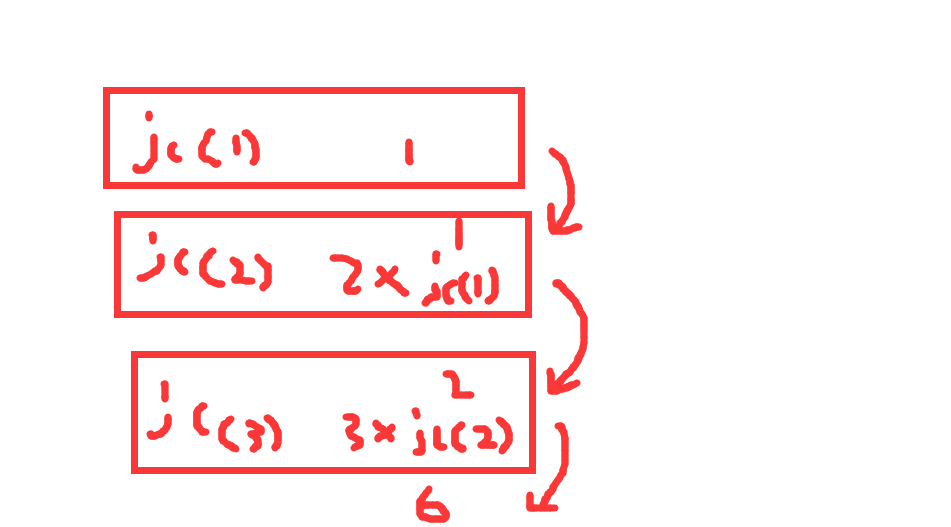

## 一 、函数基础

### （一）函数的定义

#### 1、定义

函数可以说是一个拥有名称、参数以及返回值的代码块。

#### 2、函数种类

- 内置函数
- 自定义函数

#### 3、定义函数

```python
# 语法格式
def 函数名(参数1, 参数2,...)：
	函数体
    return 返回值
```

- 关键词 def
- 函数名
- 形参（参数1, 参数2,...），可以定义，不一定使用，但是调用时需要按照要求传递相应个数的参数
- 冒号结尾
- 函数体（逻辑代码块）
- return 返回值，如果没有return，就默认返回None

比如：

```python
def login(username, password):
    # 从数据库中取出注册时的用户信息
    user_name = "zs"
    pass_word = "123456"
    # 前台传递的用户信息和存储的信息进行比对
    msg = "验证失败"
    if user_name == username and pass_word == password:
        msg = "验证通过"
    return msg

res = login("zs", "123456")
print(res)
```

#### 4、文档注释

Python支持单行（#）或者多行注释（“”“内容"""），但是还有一种注释方法叫做文档注释。

单行和多行都会被编译器去掉，文档注释可以获取。

```python
def add(x, y):
    '计算两个数之和'

    return x + y


def multiple(x, y):
    """计算两个数之乘"""

    return x * y


def sub(x, y):
    """计算两个数之差"""

    return x - y


print(sub.__doc__)

```

#### 5、无返回值函数

如果函数不需要返回值，不适用return即可；或者使用return，但return后面什么都不跟，这种情况主要用于函数从任意深度跳出。

如果函数renturn什么也不跟，就会输出None。

```python
ll = [1, 2, 3]


def a(li):
    li.extend([4, 5, 6])


res = a(ll)

print(res) # None
print(ll) # [1,2,3,4,5,6]

# 任意深度跳出
def b():

    for i in range(10):
        for j in range(10):
            if i > 3:
                return
        print(i)

b()
"""
0
1
2
3
"""
```

### （二）函数参数

- 普通参数
- 动态传参
- 作用域
- 案例

#### 1、普通传参

函数形参的位置很重要，实参的传递都是按照形参的位置一一传递。

```python
def bar(name, age):
    return "%s-%s" % (name, age)


res = bar("zs", 19)
print(res)
```

- 关键字传参

参数比较多，不一定记住每一个参数的位置，此时可以进行关键字传参。注意关键字参数必须放到位置参数的后面，否则抛出异常。

另外，关键字传参可以指定默认值，这样如果不传递实参是不会报错。

```python
def bar(name, age, gender):
    return "%s-%s-%s" % (name, age, gender)


res = bar("zs", 19, gender="male")
print(res)

def bar(name, age, gender="male"):
    return "%s-%s-%s" % (name, age, gender)


res = bar("zs", 19)
print(res)
```

#### 2、动态传参

##### 2.1 *args

- 序列可变参数

```python
def dynamic(*args):
    print(args)  # ('hello', 1, ['a', 'b', 'c'])


dynamic("hello", 1, ['a', 'b', 'c'])

```

args前面加一个 `*`表示该参数是一个可变参数，在调用dynamic这个函数时，可以传递任意的不同数据类型和不同个数的实参，从输出结果看，可变参数是以元组的形式接收的。

使用可变参数需要注意形参的位置，通常既有普通参数又有可变参数，可变参数如果放到前面或者中间，后面的普通参数需要以关键字传参。

```python
def a(*args, a):
    print(a)
    print(args)
    if args:  # ('abc',)
        return "{}-{}".format(a, args[0])
    return a

res = a(1, "abc", a=2)
print(res)
```

如果在中间也是需要关键字传参的，或者指定默认值。

- 序列作为函数参数值

```python
def dynamic(p1, p2):
    print(p1)
    print(p2)


l1 = ("a", "b")
# * 将序列中的每一个元素进行传入
dynamic(*"ab")

def dynamic(*params):
    print("*params", *params)  # 序列中的每一单个元素
    print(params) # (a, b) # 以元组的形式接收


l1 = ["a", "b"]
dynamic(*l1)
```

##### 2.2 **kwargs

如果传递的以已关键字为主，就是通过字典的方式接收。

```python
# 关键字传参，字典接收
def bar(a, **kwargs):
    print(a)
    print(kwargs)


bar(1, b=2, c=3)


# 传递字典
def ha(a, **kwargs):
    print(a)
    print(kwargs)


ha(1, **{"b": 2, "c": 3})  # 两个 ** 解析字典

```

kwargs是处理关键字传参的可变参数，是以字典的形式接收的。

##### 2.3 用法

```python
log_text = "192.168.111.23 访问了你的网站,查看了你的主页,在2022-11-12日访问的"


def handle_log(seg, *args, **kwargs):
    if args:
        seg = args[0]
    msg = log_text.split(seg)
    print(msg)


# 后期需要变化以 - 进行分隔
handle_log(",", "-")

```

一般前面定义常用的普通形参，后面可以使用 *args，**kwarg防止形参、实参个数不匹配造成错误。

#### 3、作用域

指的是变量、函数、类等生效的范围，直接在模块中顶层定义的变量、函数都属于全局作用域，而在函数内部定义的作用域属于函数本身的局部作用域，在函数作用域中定义变量，上一层作用域不可见。

```python
x = 10  # 全局作用域，整个模块都可以用


def foo():
    x = 20  # 局部作用域，只在当前函数内部生效


foo()

print(x)  # 10

```

在上面的代码中，全局变量x=10和局部变量x=20是两个不同的变量，在全局作用域中只能看到x=10，而在局部作用域中也只能看到x = 20。

当然，局部作用域是可以访问上一层的作用域，除非它本身不存在这个变量。

```python
x = 10


def foo():
    print(x)


foo()

```

局部可以访问到全局，但是全局无法访问局部。

- global

全局变量关键字，如果在局部作用域中声明一个变量为全局变量可以使用这个关键字

```python
x = 10


def foo():
    global x  # 引入定义的全局变量
    x = 20


foo()

print(x)  # 20

```

通过global实现在局部作用域修改全局变量。

- nonlocal

```python
x = 5


def outer():
    x = 10

    def foo():
        nonlocal x  # 指定上一级的变量（非全局变量），如果没有就继续往常查找，知道找到为止
        print(x)

    return foo


outer()()

```

用来在函数或其它作用域中使用外层（非全局）变量。

## 二、函数进阶

### （一）匿名函数

匿名函数顾名思义就是没有名字的函数。

一般定义函数：

```python
def add(x, y):
    return x+y
```

这时需要定义函数，那么使用lambda匿名函数可以更简单的使用：

```python
# 语法格式
lambda x,y : x + y
```

- x,y 是其形参
- x+y 是其返回值
- lambda可以理解成def关键字，返回值是函数名

上面用lambda改造的结果：

```python
add = lambda x,y : x + y

print(add(1,2))
```

也可以这样实现：

```python
def add(x, y):
    return lambda :x+y
print(add(1,2)())
```

示例：

```python
import random

l1 = [i for i in range(1000)]
l2 = [j for j in range(1000)]

random.shuffle(l1)
random.shuffle(l2)

dict1 = {}
for i in range(1000):
    dict1[l1[i]] = l2[i]

print(dict1)
print(dict1.items())  # [(438, 497), (64, 228), (154, 368)...]

res = sorted(dict1.items(), key=lambda x: x[0])
print(res)

# def f1(item):
#     return item[0]
#
#
# res = sorted(dict1.items(), key=f1)
# print(res)

```

### （二）内置函数

#### 1、基础内置函数

- 查看所有的内置函数

```powershell
Type "help", "copyright", "credits" or "license" for more information.
>>> dir(__builtins__)
['ArithmeticError', 'AssertionError', 'AttributeError', 'BaseException', 'BlockingIOError', 'BrokenPipeError', 'BufferError', 'BytesWarning', 'ChildProcessError', 'ConnectionAbortedError', 'ConnectionError', 'ConnectionRefusedError', 'ConnectionResetError', 'DeprecationWarning', 'EOFError', 'Ellipsis', 'EnvironmentError', 'Exception', 'False', 'FileExistsError', 'FileNotFoundError', 'FloatingPointError', 'FutureWarning', 'GeneratorExit', 'IOError', 'ImportError', 'ImportWarning', 'IndentationError', 'IndexError', 'InterruptedError', 'IsADirectoryError', 'KeyError', 'KeyboardInterrupt', 'LookupError', 'MemoryError', 'ModuleNotFoundError', 'NameError', 'None', 'NotADirectoryError', 'NotImplemented', 'NotImplementedError', 'OSError', 'OverflowError', 'PendingDeprecationWarning', 'PermissionError', 'ProcessLookupError', 'RecursionError', 'ReferenceError', 'ResourceWarning', 'RuntimeError', 'RuntimeWarning', 'StopAsyncIteration', 'StopIteration', 'SyntaxError', 'SyntaxWarning', 'SystemError', 'SystemExit', 'TabError', 'TimeoutError', 'True', 'TypeError', 'UnboundLocalError', 'UnicodeDecodeError', 'UnicodeEncodeError', 'UnicodeError', 'UnicodeTranslateError', 'UnicodeWarning', 'UserWarning', 'ValueError', 'Warning', 'WindowsError', 'ZeroDivisionError', '__build_class__', '__debug__', '__doc__', '__import__', '__loader__', '__name__', '__package__', '__spec__', 'abs', 'all', 'any', 'ascii', 'bin', 'bool', 'breakpoint', 'bytearray', 'bytes', 'callable', 'chr', 'classmethod', 'compile', 'complex', 'copyright', 'credits', 'delattr', 'dict', 'dir', 'divmod', 'enumerate', 'eval', 'exec', 'exit', 'filter', 'float', 'format', 'frozenset', 'getattr', 'globals', 'hasattr', 'hash', 'help', 'hex', 'id', 'input', 'int', 'isinstance', 'issubclass', 'iter', 'len', 'license', 'list', 'locals', 'map', 'max', 'memoryview', 'min', 'next', 'object', 'oct', 'open', 'ord', 'pow', 'print', 'property', 'quit', 'range', 'repr', 'reversed', 'round', 'set', 'setattr', 'slice', 'sorted', 'staticmethod', 'str', 'sum', 'super', 'tuple', 'type', 'vars', 'zip']
>>>
```

- 查看某一个内置函数的具体用法

```python
>>> help(zip)
Help on class zip in module builtins:

class zip(object)
 |  zip(*iterables) --> A zip object yielding tuples until an input is exhausted.
 |
 |     >>> list(zip('abcdefg', range(3), range(4)))
 |     [('a', 0, 0), ('b', 1, 1), ('c', 2, 2)]
 |
 |  The zip object yields n-length tuples, where n is the number of iterables
 |  passed as positional arguments to zip().  The i-th element in every tuple
 |  comes from the i-th iterable argument to zip().  This continues until the
 |  shortest argument is exhausted.
 |
 |  Methods defined here:
 |
 |  __getattribute__(self, name, /)
 |      Return getattr(self, name).
 |
 |  __iter__(self, /)
 |      Implement iter(self).
 |
 |  __next__(self, /)
 |      Implement next(self).
 |
 |  __reduce__(...)
 |      Return state information for pickling.
 |
 |  ----------------------------------------------------------------------
 |  Static methods defined here:
 |
 |  __new__(*args, **kwargs) from builtins.type
 |      Create and return a new object.  See help(type) for accurate signature.
```

```python
"""
输入：
flower flow flew
求取 多个单词 的公共前缀
"""

first = "flower"
second = "flow"
third = "flew"

prefix = ""
res = zip(first, second, third)
print(res) 

for i in res:
    print(i)
    if len(set(i)) == 1:
        prefix += i[0]
    else:
        break
print(prefix)
```

- abs

```python
>>> help(abs)
Help on built-in function abs in module builtins:

abs(x, /)
    Return the absolute value of the argument.

>>> abs(-1)
1
>>>
```

- all

```python
>>> help(all)
Help on built-in function all in module builtins:

all(iterable, /)
    Return True if bool(x) is True for all values x in the iterable.

    If the iterable is empty, return True.

>>> all([True,1])
True
```

- any

```python
>>> help(any)
Help on built-in function any in module builtins:

any(iterable, /)
    Return True if bool(x) is True for any x in the iterable.

    If the iterable is empty, return False.

>>> any([True, 0])
True
>>>
```

#### 2、常用内置函数

##### 2.1 map

根据提供的函数对指定的序列做映射，第一个参数function是以序列中的每一个元素作为实参传递接收的，返回包含每次function函数返回值列表。

```python
l1 = [1, 2, 3]
l2 = [2, 3, 4]


# 单个可迭代对象
def f1(item):
    return item + 1


res = map(f1, l1)
print(list(res))
for i in res:
    print(i)


# 多个可迭代对象
def f2(item1, item2):
    return item1 * item2


res = map(f2, l1, l2)

print(list(res))

# lambda简易写法
res = map(lambda x, y: x * y, l1, l2)
print(list(res))

```

##### 2.2 reduce

函数会对参数序列中的元素进行累积：用传给reduce中的函数function（有两个参数）先对集合中的第1，2个元素进行操作，得到的结果再与第三个元素用function进行运算，最后得到一个结果。

reduce函数语法：

```python
reduce(function, iterble, initializer)
```

- function 具体运算的函数
- iterable 可迭代对象
- 初始值

```python
from functools import reduce

l1 = [i for i in range(100)]

# 不带初始值
# res = sum(l1)
# print(res)

# res = reduce(lambda x, y: x + y, l1) # 累积 [0,1,2...]
# print(res)

# 初始值
# res = reduce(lambda x, y: x + y, l1, 1000) # 初始值 1000
# print(res)

# 初始值cde
a = "abc"
b = "cde"
res = reduce(lambda x, y: x + y, a, b)
print(res) # cdeabc

```

##### 2.3 filter

函数用于过滤序列，过滤掉不符合条件的元素，返回由符合条件元素组成的新序列。

接收两个参数，第一个函数，第二个为序列，序列中的每一个元素作为参数传递给函数进行判断，然后返回True或False，最后将返回True的元素放到新序列中。

```python
l1 = [i for i in range(1000)]

res = filter(lambda x: x % 2 == 0, l1)
print(list(res))
```

##### 2.4 zip

将可迭代对象作为参数，将对象中的每一个元素打包成一个个的元组，然后返回由这些元组组成的列表。

如果各个可迭代对象的个数不一样，则返回列表长度与可迭代对象长度最短的那个对象相同。利用 * 号，可以将元组解压成列表。

- 案例一

```python
"""
输入：
flower flow flew
求取 多个单词 的公共前缀
"""

first = "flower"
second = "flow"
third = "flew"

prefix = ""
res = zip(first, second, third)
print(res) 

for i in res:
    print(i)
    if len(set(i)) == 1:
        prefix += i[0]
    else:
        break
print(prefix)
```

- 案列二

```python
user_info = {"name": "zs", "age": 20, "addr": "german"}

print(user_info.items())  # dict_items([('name', 'zs'), ('age', 20), ('addr', 'german')])

res = zip(user_info.keys(), user_info.values())
print(list(res))  # [('name', 'zs'), ('age', 20), ('addr', 'german')]
```

#### 3、自定义reduce函数

```python
l1 = [i for i in range(100)]


def func(iterable, initial=None):
    sum = 0
    if initial:
        sum = initial

    for i in iterable:
        sum += i

    return sum


def reduce(func, iterable, initial=None):
    return func(iterable, initial)


res = reduce(func, l1, 1000)
print(res)
```

#### 4、其它

##### 4.1 三元表达式

```python
a = 10

# 一般方式
if a > 10:
    print("a大于10")
else:
    print("a小于等于10")

# 三元表达式
print("a大于10") if a > 10 else print("a小于等于10")
# a > 10 一元
# print("a大于10") 二元
#  print("a小于等于10") 三元

# 函数中使用三元表达式
def f1():
    a = 10
    return "a大于10" if a > 10 else "a小于等于10"

```

##### 4.2 列表解析式

-  普通列表生成的方式

```python
l1 = []

for i in range(1, 101):
    l1.append(i)
print(l1)
```

- 列表解析式

```python
# 列表解析式
l2 = [i for i in range(1, 101)]
print(l2)
```

- 列表解析式中加入条件语句

```python
# 列表解析式加入条件判断
l3 = [i for i in range(1, 101) if i % 2 == 1]
print(l3)
```

- 列表解析式加入多重循环

```python
# 列表解析式加入多重循环
l4 = [i + j for i in "ABC" for j in "XYZ"]  # ABC是外层循环
print(l4)
```

##### 4.3 列表生成式

比起列表解析式，列表生成式会更加节约内存，它只需要将列表解析式的 [] 更换为 () 即可。

```python

# 列表解析式
l1 = [i for i in range(10)]
print(l1)

# 列表生成式
l2 = (i for i in range(10, 20))
print(l2.__next__())
print(list(l2))

for i in l2:
    print(i)

```

### （三）递归函数

所谓递归就是再函数内部调用自身，在进行递归调用时必须有一个终止条件处理递归函数返回的数据，如果没有终止条件，会产生栈溢出的问题。

#### 1、阶乘

>4! = 4 * 3 * 2 *1
>
>3! = 3 * 2 *1
>
>...

假设计算阶乘的函数jc(n)，其中n是整数型参数，该函数表示计算n的阶乘。

>n! = 1 * 2 * 3 ...n
>
>相当于：
>
>n! = n * (n-1)!

```python
jc(n) = n * jc(n-1)
```

```python
def jc(n):
    """
    5! = 5 * 4 * 3 * 2 * 1
    jc(n) = n * jc(n-1)
    :param n:
    :return:
    """
    if n == 1:
        return 1
    else:
        return n * jc(n - 1)  # 3 * jc(2) --> 3 * 2 * jc(1) --> 3 * 2 * 1 * jc(0)


res = jc(5)  # 5 * 4 * 3 * 2 * 1 = 120
print(res)

```



上图中3块红色的区域可以理解成栈，执行完成后会返回（return）栈中的值，结果就是 3 * 2 * 1 = 6

#### 2、斐波拉契

> 这样的一串数字： 0 1 1 2 3 5 8 ...
>
> 输入对应的第几位数，返回该位置的数字。
>
> 如：输入 3，输出1  

分析：

>1 = 1 + 0
>
>2 = 1 + 1
>
>fibonacci(n) = fibonacci(n-1) + fibonacci(n-2)

```python
def fibonacci(n):
    if n == 1:
        return 0
    elif n == 2:
        return 1
    else:
        return fibonacci(n - 1) + fibonacci(n - 2)

res = fibonacci(5)
print(res)
```

其它方式：

```python
def fibonacci(n):
    for i in range(n - len(l1)):  # n = 3 (0,1,2)
        l1.append(l1[len(l1) - 1] + l1[len(l1) - 2])


fibonacci(5)
print(l1[-1])
```

### （四）装饰器

- 简单装饰器
- 带参数装饰器
- 带返回值装饰器

#### 1、简单装饰器

什么是装饰器？举个例子：

- 原有函数

```python
def f1():
    time.sleep(1)
    print("函数执行完毕！")


f1()
```

- 实现计算函数运行时间

```python
def f1():
    start_time = time.time()
    time.sleep(1)
    print("函数执行完毕！")
    end_time = time.time()
    print("执行时间：",end_time-start_time)

f1()
```

现在需要给1000个上面的函数加上统计时间的功能，如何完成？

装饰器是一个在不改变原有函数调用方式和源代码的基础上来添加功能的高阶函数，所以实现装饰器，需要满足：

- 高阶函数（传入的是函数名称、返回值也是函数名称）
- 函数嵌套

```python
def outer(func):
    def inner():
        print("outer")
        start_time = time.time()
        func()
        end_time = time.time()
        print("执行时间：", end_time - start_time)
    return inner
```

调用：

```python
f1 = outer(f1)
f1()
# @outer 相当于 f1= outer(f1)
```

所以：

```python
@outer
def f1():
    time.sleep(1)
    print("函数执行完毕！")
```

#### 2、多个装饰器执行顺序

```python
import time


def outer(func):
    print("开始执行outer")

    def inner1():
        print("outer")
        start_time = time.time()
        func()
        end_time = time.time()
        print("执行时间：", end_time - start_time)

    return inner1


def wrapper(func):
    print("开始执行wrapper")

    def inner2():
        func()
        print("wrapper")

    return inner2


@wrapper
@outer  # inner1   --> wrapper(inner1) 没有执行inner1 --> inner2   # wrapper(outer(func))
def f1():
    time.sleep(1)
    print("函数执行完毕！")


"""
"开始执行outer"
"开始执行wrapper"
"outer"
"函数执行完毕！"
执行时间：1.0221
"wrapper"
"""

# f1 = outer(f1)
f1()
```

从下往上依次执行，里面装饰器返回值作为外面的参数：wrapper(outer(func))

#### 3、带参数的装饰器

有时被装饰的函数带有参数，需要进行传参：

```python
def wrapper(func):
    def inner(*args, **kwargs):  # args (1, 2)
        func(*args, **kwargs)  # func(args[0],args[1]) 接收参数

    return inner


@wrapper  # f1 = inner(*args, **kwargs)
def f1(a, b):
    print(a + b)


f1(1, 2) # 传参

```

带可变参数的装饰器会更加实用。

#### 4、带返回值的装饰器

```python
def wrapper(func):
    def inner(*args, **kwargs):
        func(*args, **kwargs)

    return inner


@wrapper
def f1(a, b):
    return a + b


res = f1(1, 2)

print(res)  # None
```

这样打印的输出结果是None，因为装饰器中并没有接收函数的返回值。

```python
def wrapper(func):
    def inner(*args, **kwargs):
        res = func(*args, **kwargs) # 接收结果并且返回
        return res

    return inner


@wrapper
def f1(a, b):
    return a + b


res = f1(1, 2)

print(res)  # 3
```

上面接收了函数的结果并且返回了，没有问题。

### （五）案例

- 登陆检测

```python
# 登陆检查
# 拥有权限的管理员
admin_info = [{"id": 1012, "username": "superadmin01", "password": "123456"},
              {"id": 1013, "username": "superadmin02", "password": "123456"},
              ]

# 一旦登陆成功，保存登陆的人的信息
login_user = {"username": "superadmin03", "password": "123456"}


def check_login(func):
    def inner(*args, **kwargs):
        for user in admin_info:
            if login_user.get("username") == user.get("username") and login_user.get("password") == user.get(
                    "password"):
                func()
                break
            else:
                print("非管理员，无权限操作！")
                break

    return inner


@check_login
def add_student():
    """增加学生的代码逻辑"""
    print("增加学生成功！")


@check_login
def del_student():
    pass


add_student()
del_student()

```

- 函数重试机制

```python
# 函数重试机制 微服务

def retry(tries):
    def wrapper(func):
        def inner(*args, **kwargs):
            for _ in range(tries):
                func(*args, **kwargs)

        return inner

    return wrapper


@retry(tries=5)  # @wrapper
def get_goods_price():
    print("执行成功！")
    pass


get_goods_price()

```

### （六）练习

使用函数对学生信息管理系统进行重构：

- 不同的功能对应不同的函数
- 登陆检测


