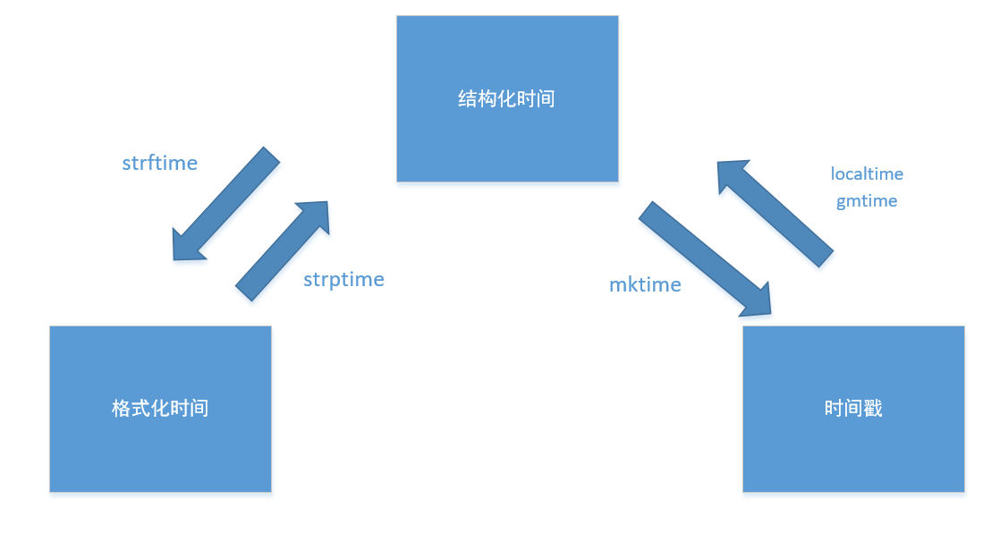

## 一、time模块

三种表示时间的方式：

- 时间戳
- 格式化时间字符串
- 结构化时间

### （一）时间戳

从1970年1月1日00:00:00开始按秒计算到目前。

```:zero:
import time

print(time.time())

"""
1673073701.7192478
"""
```

### （二）格式化时间字符串

根据传入格式，将一个时间元组转成字符串的形式。

```:zero:
import time

print(time.strftime("%Y/%m/%d %H:%M:%S"))
```

>Commonly used format codes:
>​    
>​    %Y  Year with century as a decimal number.
>​    %m  Month as a decimal number [01,12].
>​    %d  Day of the month as a decimal number [01,31].
>​    %H  Hour (24-hour clock) as a decimal number [00,23].
>​    %M  Minute as a decimal number [00,59].
>​    %S  Second as a decimal number [00,61].
>​    %z  Time zone offset from UTC.
>​    %a  Locale's abbreviated weekday name.
>​    %A  Locale's full weekday name.
>​    %b  Locale's abbreviated month name.
>​    %B  Locale's full month name.
>​    %c  Locale's appropriate date and time representation.
>​    %I  Hour (12-hour clock) as a decimal number [01,12].
>​    %p  Locale's equivalent of either AM or PM.

### （三）结构化时间

```python
import time

print(time.localtime())
"""
time.struct_time(tm_year=2023, tm_mon=1, tm_mday=7, tm_hour=14, tm_min=51, tm_sec=10, tm_wday=5, tm_yday=7, tm_isdst=0)

"""
```

本地时区的 `struct_time`

### （四）转换关系



```python
import time

print(time.time())  # 时间戳

# 将当前时间戳转成结构化时间
print(time.localtime())  # 结构化时间
print(time.gmtime())  # 结构化时间

# 将结构时间转成时间戳
print(time.mktime(time.localtime()))

# 将结构化时间转成格式化时间
print(time.strftime("%Y-%m-%d"))  # 格式时间

# 将格式化时间转成结构化时间
print(time.strptime("2023-01-07 15:10", "%Y-%m-%d %H:%M"))  # 结构时间

```

### （五）方法总结

- localtime 将秒转成时间元组
- gmtime 将秒转成时间元组
- mktime 将时间元组转成时间戳
- sleep 睡眠时间
- time 时间戳
- strftime 将字符串转成时间元组
- strptime 将时间元组转成字符串

**注意**：时间元组理解成结构化时间

## 二、random模块

- 整数函数
- 序列函数
- 实值分布
- 实例

### （一）整数函数

#### 1、random.randrange(self, start, stop=None, step=_ONE)

```python
import random

print(random.randrange(5))  # [0, 5)整数
print(random.randrange(4, 10))  # [4, 10) 整数
print(random.randrange(4, 10, 2)) # [4, 10] 偶数整数
```

#### 2、random.randint(self, a, b)

```python
print(random.randint(4, 10)) # [4, 10] 相当于 randrange(a, b+1)
```

### （二）序列函数

#### 1、choice(self, seq)

```python
import random

seq = [i for i in range(5)]

print(random.choice(seq)) # 从序列中随机返回一个元素，如果是个空序列出现 IndexError错误

```

#### 2、sample(self, population, k, *, counts=None)

```python
population = [1, 2, 3, 4, 5, 6]
print(random.sample(population, 2)) # 返回从集合或者列表中返回k个元素的列表，一般用于随机抽样
```

#### 3、shuffle(self, x, random=None)

```python

seq = [i for i in range(1000)]

print(seq)

random.shuffle(seq) # 打乱顺序

print(seq)
```

#### 4、实值分布

- random.random() 产生(0.0, 1.0)随机浮点数
- random.uniform(1, 2) 产生[a, b] 之间的随机浮点数
- random.triangular() 均匀分布
- random.expovariate(0.3)   指数分布
- random.normalvariate(4, 0.5) 正态分布

```python
import random

print(random.uniform(1, 2)) # 产生[a, b] 之间的随机浮点数
print(random.triangular())
print(random.expovariate(0.3)) #指数分布
print(random.normalvariate(4, 0.5)) # 正态分布
```

#### 5、实例

- 验证码

```python
import random


def generate_code():
    """5个数字字母组合的验证码"""

    l1 = [str(i) for i in range(0, 10)]
    l2 = [i for i in range(65, 91)]

    l3 = random.sample(l1, 3)
    l4 = random.sample(l2, 2)
    l4 = [chr(j) for j in l4]

    l3.extend(l4)

    res = "".join(l3)
    return res


res = generate_code()
print(res)

```

## 三、re模块

re模块是Python特有的匹配字符串的模块，很多功能都是基于正则表达式实现的，正则表达式是对字符串进行模糊匹配，提取自己需要的字符串部分，正则对所有语言都是通用的。

- re模块是Python特有的
- 正则表达式对所有语言通用
- 针对字符串类型

所以需要先学习正则表达式。

### （一）常用正则

#### 1、字符组

在同一个位置可能出现的各种字符组成了一个字符组，在正则表达式中用[]表示

| `正则`         | `待匹配字符` | `匹配结果` | `说明`                                                       |
| -------------- | ------------ | ---------- | ------------------------------------------------------------ |
| `[0123456789]` | `8`          | `True`     | `在一个字符组里枚举合法的所有字符，字符组里的任意一个字符和"待匹配字符"相同都视为可以匹配` |
| `[0123456789]` | `a`          | `False`    | `由于字符组中没有"a"字符，所以不能匹配`                      |
| `[0-9]`        | `7`          | `True`     | `也可以用-表示范围,[0-9]就和[0123456789]是一个意思`          |
| `[a-z]`        | `s`          | `True`     | `同样的如果要匹配所有的小写字母，直接用[a-z]就可以表示`      |
| `[A-Z]`        | `B`          | `True`     | `[A-Z]就表示所有的大写字母`                                  |
| `[0-9a-fA-F]`  | `e`          | `True`     | `可以匹配数字，大小写形式的a～f，用来验证十六进制字符`       |

#### 2、字符

| `元字符` | `匹配内容`                         |
| -------- | ---------------------------------- |
| .        | 匹配除换行符以外的任意一个字符     |
| \w       | 匹配字母或数字或下划线             |
| \s       | 匹配任意的空白符                   |
| \d       | 匹配数字                           |
| \n       | 匹配一个换行符                     |
| \t       | 匹配一个制表符                     |
| \b       | 匹配一个单词的结尾                 |
| ^        | 匹配字符串的开始                   |
| $        | 匹配字符串的结尾                   |
| \W       | `匹配非字母或数字或下划线`         |
| \D       | `匹配非数字`                       |
| \S       | `匹配非空白符`                     |
| a\|b     | `匹配字符a或字符b`                 |
| ()       | `匹配括号内的表达式，也表示一个组` |
| [...]    | `匹配字符组中的字符`               |
| [^...]   | `匹配除了字符组中字符的所有字符`   |

#### 3、量词

| `量词` | `用法说明`       |
| ------ | ---------------- |
| *      | 重复零次或更多次 |
| +      | 重复一次或更多次 |
| ?      | 重复零次或一次   |
| {n}    | 重复n次          |
| {n,}   | 重复n次或更多次  |
| {n,m}  | 重复n到m次       |

#### 2、正则表达式的使用

##### 2.1  . ^ $

| 正则 | 待匹配字符 | 匹配结果 | 说明               |
| ---- | ---------- | -------- | ------------------ |
| a.   | abacad     | abacad   | 匹配所有"a."的字符 |
| ^a.  | abacad     | ab       | 只从开头匹配"a."   |
| a.$  | abacad     | ad       | 只匹配结尾的"a.$"  |

##### 2.2  * + ? { }

| 正则    | 待匹配字符 | 匹配结果   | 说明                                                    |
| ------- | ---------- | ---------- | ------------------------------------------------------- |
| a.?     | abefacgad  | ab ac ad   | ?表示重复零次或一次，即只匹配"a"后面一个任意字符。      |
| a.*     | abefacgad  | abefacgad  | *表示重复零次或多次，即匹配"a"后面0或多个任意字符。     |
| a.+     | abefacgad  | abefacgad  | +表示重复一次或多次，即只匹配"a"后面1个或多个任意字符。 |
| a.{1,2} | abefacgad  | abe acg ad | {1,2}匹配1到2次任意字符。                               |

注意：前面的*,+,?等都是贪婪匹配，也就是尽可能匹配，后面加?号使其变成惰性匹配

| 正则 | 待匹配字符 | 匹配结果 | 说明     |
| ---- | ---------- | -------- | -------- |
| a.*? | abefacgad  | a a a    | 惰性匹配 |

##### 2.3 字符集［］［^］

| 正则       | 待匹配字符 | 匹配结果    | 说明                                  |
| ---------- | ---------- | ----------- | ------------------------------------- |
| a[befcgd]* | abefacgad  | abef acg ad | `表示匹配"a"后面[befcgd]的字符任意次` |
| a[^f]*     | abefacgad  | abe acgad   | `表示匹配一个不是"f"的字符任意次`     |
| [\d]       | 412a3bc    | 4 1 2 3     | `表示匹配任意一个数字，匹配到4个结果` |
| [\d]+      | 412a3bc    | 412 3       | `表示匹配任意个数字，匹配到2个结果`   |

##### 2.4 分组 ()与 或 ｜［^］

　　身份证号码是一个长度为15或18个字符的字符串，如果是15位则全部由数字组成，首位不能为0；如果是18位，则前17位全部是数字，末位可能是数字或x，下面我们尝试用正则来表示：

| 正则                               | 待匹配字符         | 匹配结果           | 说明                                                         |
| ---------------------------------- | ------------------ | ------------------ | ------------------------------------------------------------ |
| ^[1-9]\d{13,16}[0-9x]$             | 110101198001017032 | 110101198001017032 | 表示可以匹配一个正确的身份证号                               |
| ^[1-9]\d{13,16}[0-9x]$             | 1101011980010170   | 1101011980010170   | `表示也可以匹配这串数字，但这并不是一个正确的身份证号码，它是一个16位的数字` |
| ^[1-9]\d{14}(\d{2}[0-9x])?$        | 1101011980010170   | False              | `现在不会匹配错误的身份证号了()表示分组，将\d{2}[0-9x]分成一组，就可以整体约束他们出现的次数为0-1次` |
| ^([1-9]\d{16}[0-9x]\|[1-9]\d{14})$ | 110105199812067023 | 110105199812067023 | `表示先匹配[1-9]\d{16}[0-9x]如果没有匹配上就匹配[1-9]\d{14}` |

##### 2.5 转义符 \

　　在正则表达式中，有很多有特殊意义的是元字符，比如\n和\s等，如果要在正则中匹配正常的"\n"而不是"换行符"就需要对"\"进行转义，变成'\\'。

　　在python中，无论是正则表达式，还是待匹配的内容，都是以字符串的形式出现的，在字符串中\也有特殊的含义，本身还需要转义。所以如果匹配一次"\n",字符串中要写成'\\n'，那么正则里就要写成"\\\\n",这样就太麻烦了。这个时候我们就用到了r'\n'这个概念，此时的正则是r'\\n'就可以了。

| 正则    | 待匹配字符 | 匹配 结果 | 说明                                                         |
| ------- | ---------- | --------- | ------------------------------------------------------------ |
| \n      | \n         | False     | `因为在正则表达式中\是有特殊意义的字符，所以要匹配\n本身，用表达式\n无法匹配` |
| \\n     | \n         | True      | `转义\之后变成\\，即可匹配`                                  |
| "\\\\n" | '\\n'      | True      | `如果在python中，字符串中的'\'也需要转义，所以每一个字符串'\'又需要转义一次` |
| r'\\n'  | r'\n'      | True      | `在字符串之前加r，让整个字符串不转义`                        |

##### 2.6 贪婪匹配

贪婪匹配：在满足匹配时，匹配尽可能长的字符串，默认情况下，采用贪婪匹配

| 正则  | 待匹配字符          | 匹配结果            | 说明                                                         |
| ----- | ------------------- | ------------------- | ------------------------------------------------------------ |
| <.*>  | <script>...<script> | <script>...<script> | `默认为贪婪匹配模式，会匹配尽量长的字符串`                   |
| <.*?> | <script>...<script> | <script> <script>   | `加上？为将贪婪匹配模式转为非贪婪匹配模式，会匹配尽量短的字符串` |

几个常用的非贪婪匹配Pattern

```
*? 重复任意次，但尽可能少重复
+? 重复1次或更多次，但尽可能少重复
?? 重复0次或1次，但尽可能少重复
{n,m}? 重复n到m次，但尽可能少重复
{n,}? 重复n次以上，但尽可能少重复


```

.*?的用法

```
. 是任意字符
* 是取 0 至 无限长度
? 是非贪婪模式。
何在一起就是 取尽量少的任意字符，一般不会这么单独写，他大多用在：
.*?x

就是取前面任意长度的字符，直到一个x出现


```

#### 3、re模块

##### 3.1 常量、属性

- re.A（re.ASCII）

让\w，\W，\b，\B，\d，\D，\s和\S 执行ASCII-只匹配完整的Unicode匹配代替。这仅对Unicode模式有意义，而对于字节模式则忽略。

- re.I（re.IGNORECASE）

执行不区分大小写的匹配；类似的表达式也[A-Z]将匹配小写字母。

- re.L（re.LOCALE）

　　让\w，\W，\b，\B和区分大小写的匹配取决于当前的语言环境。该标志只能与字节模式一起使用。不建议使用此标志，因为语言环境机制非常不可靠，它一次只能处理一种“区域性”，并且仅适用于8位语言环境。默认情况下，Python 3中已为Unicode（str）模式启用了Unicode匹配，并且能够处理不同的语言环境/语言。

- re.M（re.MULTILINE）

　　指定时，模式字符'^'在字符串的开头和每行的开头（紧随每个换行符之后）匹配；模式字符''在字符串的末尾和每行的末尾（紧接在每个换行符之前）匹配。默认情况下，'^' 仅在字符串的开头，字符串''在字符串的末尾和每行的末尾（紧接在每个换行符之前）匹配。默认情况下，'^' 仅在字符串的开头，字符串''的末尾和字符串末尾的换行符（如果有）之前立即匹配。

- re.S（re.DOTALL）

使'.'特殊字符与任何字符都匹配，包括换行符；没有此标志，'.'将匹配除换行符以外的任何内容。

##### 3.2 常用方法

- re.compile（pattern，flags = 0 ）

将正则表达式模式编译为正则表达式对象，可使用match()，search()以及下面所述的其他方法将其用于匹配

```python
>>> prog = re.compile('\d{2}') # 正则对象

>>> prog.search('12abc')
<_sre.SRE_Match object; span=(0, 2), match='12'>
>>> prog.search('12abc').group() # 通过调用group()方法得到匹配的字符串,如果字符串没有匹配，则返回None。
'12'

>>> prog.match('123abc')
<_sre.SRE_Match object; span=(0, 2), match='12'>
>>> prog.match('123abc').group()
'12'
>>>
```

- re.search（pattern，string，flags = 0 ）

　　扫描字符串以查找正则表达式模式产生匹配项的第一个位置 ，然后返回相应的match对象。`None`如果字符串中没有位置与模式匹配，则返回；否则返回false。请注意，这与在字符串中的某个点找到零长度匹配不同。

```python
#在这个字符串进行匹配，只会匹配一个对象
>>> re.search('\w+','abcde').group()
'abcde'
>>> re.search('a','abcde').group()
'a'
>>>
```

- re.match（pattern，string，flags = 0 ）

如果字符串开头的零个或多个字符与正则表达式模式匹配，则返回相应的匹配对象。None如果字符串与模式不匹配，则返回；否则返回false。请注意，这与零长度匹配不同。

```python
# 同search,不过在字符串开始处进行匹配，只会匹配一个对象
>>> re.match('a','abcade').group()
'a'
>>> re.match('\w+','abc123de').group()
'abc123de'
>>> re.match('\D+','abc123de').group() #非数字
'abc'
>>>
```

- re.fullmatch（pattern，string，flags = 0 ）

如果整个字符串与正则表达式模式匹配，则返回相应的match对象。None如果字符串与模式不匹配，则返回；否则返回false。请注意，这与零长度匹配不同。

```python
>>> re.fullmatch('\w+','abcade').group()
'abcade'
>>> re.fullmatch('abcade','abcade').group()
'abcade'
>>>
```

- re.split（pattern，string，maxsplit = 0，flags = 0 ）

　　通过出现模式来拆分字符串。如果在pattern中使用了捕获括号，那么模式中所有组的文本也将作为结果列表的一部分返回。如果maxsplit不为零，则最多会发生maxsplit分割，并将字符串的其余部分作为列表的最后一个元素返回。

```python
>>> re.split('[ab]', 'abcd') # 先按'a'分割得到''和'bcd',在对''和'bcd'分别按'b'分割
['', '', 'cd']
>>> re.split(r'\W+', 'Words, words, words.')
['Words', 'words', 'words', '']
>>> re.split(r'(\W+)', 'Words, words, words.')
['Words', ', ', 'words', ', ', 'words', '.', '']
>>> re.split(r'\W+', 'Words, words, words.', 1)
['Words', 'words, words.']
>>> re.split('[a-f]+', '0a3B9', flags=re.IGNORECASE)
['0', '3', '9']
```

如果分隔符中有捕获组，并且该匹配组在字符串的开头匹配，则结果将从空字符串开始。字符串的末尾也是如此：

```python
>>> re.split(r'(\W+)', '...words, words...')
['', '...', 'words', ', ', 'words', '...', '']
```

- re.findall（pattern，string，flags = 0 ）

　　以string列表形式返回string中pattern的所有非重叠匹配项。从左到右扫描该字符串，并以找到的顺序返回匹配项。如果该模式中存在一个或多个组，则返回一个组列表；否则，返回一个列表。如果模式包含多个组，则这将是一个元组列表。空匹配项包含在结果中。

```python
>>> re.findall('a', 'This is a beautiful place!')
['a', 'a', 'a']
>>>
```

- re.finditer（pattern，string，flags = 0 ）

返回一个迭代器，该迭代器在string类型的RE 模式的所有非重叠匹配中产生匹配对象。 从左到右扫描该字符串，并以找到的顺序返回匹配项。空匹配项包含在结果中。

```python
>>> re.finditer('[ab]', 'This is a beautiful place!')
<callable_iterator object at 0x0000000000DCDA90> #迭代器对象
>>> ret=re.finditer('[ab]', 'This is a beautiful place!')
>>> next(ret).group() #查看下一个匹配值
'a'
>>> [i.group() for i in ret] #查看剩下所有匹配的值python
['b', 'a', 'a']
>>>
```

- re.sub（pattern，repl，string，count = 0，flags = 0 ）

　　返回通过用替换repl替换字符串中最左边的不重叠模式所获得的字符串。如果找不到该模式， 则返回的字符串不变。 repl可以是字符串或函数；如果是字符串，则处理其中的任何反斜杠转义。即，将其转换为单个换行符，将其转换为回车，依此类推。count参数表示将匹配到的内容进行替换的次数

```python
>>> re.sub('\d', 'S', 'abc12jh45li78', 2) #将匹配到的数字替换成S,替换2个
'abcSSjh45li78'

>>> re.sub('\d', 'S', 'abc12jh45li78') #将匹配到所有的数字替换成S
'abcSSjhSSliSS'
>>>
```

- re.subn（pattern，repl，string，count = 0，flags = 0 ）

执行与相同的操作sub()，但返回一个元组。(new_string, number_of_subs_made)

```python
>>> re.subn('\d', 'S', 'abc12jh45li78', 3)
('abcSSjhS5li78', 3)
>>>
```

- re.escape(pattern)

escape中的所有字符*图案*，除了ASCII字母，数字和`'_'`。如果要匹配可能包含正则表达式元字符的任意文字字符串，这将很有用。

```python
>>> re.escape('python.exe\n')
'python\\.exe\\\n'
>>>
```

- search（）与match（）方法

Python提供了两种基于正则表达式的原始操作： re.match()仅在字符串的开头匹配，re.search()检查匹配项，在字符串中的任何位置检查匹配项（这是Perl的默认设置）。

```python
>>> re.match("c", "abcdef") #Not match
>>> re.search("c", "abcdef") #match
<_sre.SRE_Match object; span=(2, 3), match='c'>
>>>
```

以开头的正则表达式'^'可用于search()限制字符串开头的匹配项：

```python
>>> re.match("c", "abcdef") #Not match
>>> re.search("^c", "abcdef") #Not match
>>> re.search("^a", "abcdef") #match
<_sre.SRE_Match object; span=(0, 1), match='a'>
>>>
```


