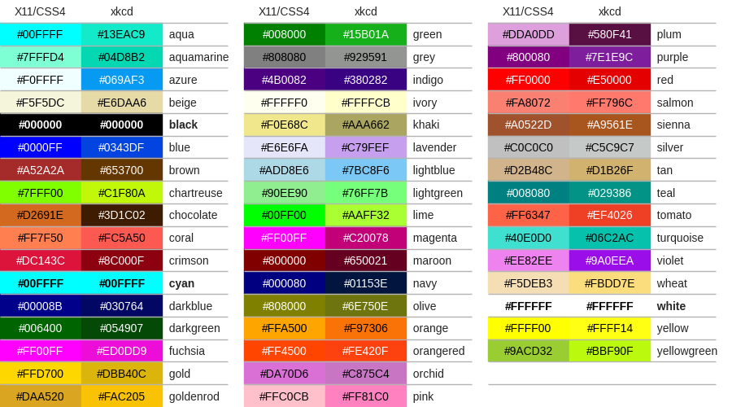
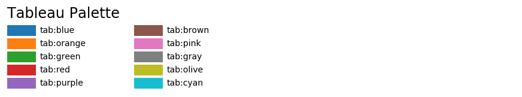
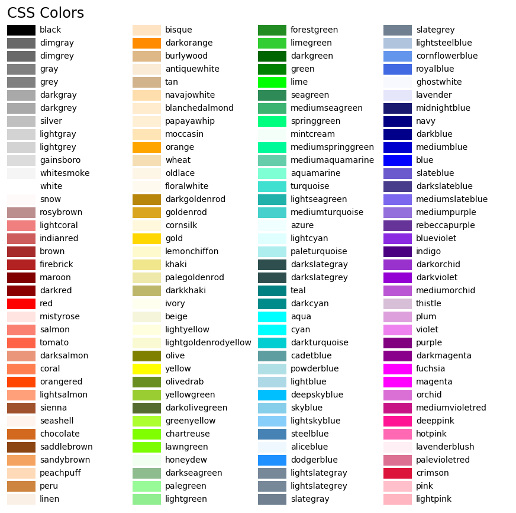

## 一、简介

Matplotlib是Python的绘图库，轻松的进行数据可视化（图形化），提供多种多样的输出格式。

- 线图
- 散点图
- 条形图
- 3D图形

...

## 二、一个简单的例子

```python
import matplotlib.pyplot as plt
import numpy as np

fig, ax = plt.subplots() # figure窗体  axes坐标系
ax.plot(np.arange(5), np.arange(5)) # 在axes中画图
plt.show() # 显示图像
```

当然你也可以通过更简单的方式创建：

```python
import matplotlib.pyplot as plt
import numpy as np

plt.plot(np.arange(5), np.arange(5))
plt.show() # 显示图像
```

## 三、Figure的组成

如下图：


Figure包含四个层级：

- Figure 顶层，用来容纳所有的绘图元素
- Axes 子图一个Figure可以拥有多个子图
- Axis 是Axes的下属层级，处理所有的坐标轴
- Tick 是Axis的下属层级，处理刻度相关的元素

## 四、两种绘图接口

matplotlib提供了两种常用的绘图接口：

- 显式创建figure、axes，然后在axes上调用绘图方法（OO模式）
- 依赖pyplot自动创建

**显式**：

```python
import matplotlib.pyplot as plt
import numpy as np

x = np.linspace(0, 2, 100)
fig, ax = plt.subplots()
ax.plot(x, x**3)

plt.show()
```

**隐式**：

```python
import matplotlib.pyplot as plt
import numpy as np

x = np.linspace(0, 2, 100)

plt.plot(x, x**2)

plt.show()
```

## 五、绘图的通用模板

```python
import matplotlib as mpl
import matplotlib.pyplot as plt

import numpy as np

# 1、准备数据
x = np.linspace(0, 2, 100)
y1 = x ** 2
y2 = x ** 3

# 2、设置绘图的样式
mpl.rc('lines', linewidth=5, linestyle='-.')

# 3、定义布局
fig, ax = plt.subplots()

# 4、绘制图像
ax.plot(x, y1, label="liner1")
ax.plot(x, y2, label="liner2")

# 5、标签、文字、图例
ax.set_xlabel('x label')
ax.set_ylabel('y label')
ax.set_title('simple line')
ax.legend()

# 6、显示图像
plt.show()

```

## 六、绘图样式及色彩

3种方式：

- 预定义样式
- 自定义样式
- rcparams

### （一）预定义样式

matplotlib提供了很多内置的样式供我们使用：

```python
print(plt.style.available)
```

>['Solarize_Light2', '_classic_test_patch', '_mpl-gallery', '_mpl-gallery-nogrid', 'bmh', 'classic', 'dark_background', 'fast', 'fivethirtyeight', 'ggplot', 'grayscale', 'seaborn-v0_8', 'seaborn-v0_8-bright', 'seaborn-v0_8-colorblind', 'seaborn-v0_8-dark', 'seaborn-v0_8-dark-palette', 'seaborn-v0_8-darkgrid', 'seaborn-v0_8-deep', 'seaborn-v0_8-muted', 'seaborn-v0_8-notebook', 'seaborn-v0_8-paper', 'seaborn-v0_8-pastel', 'seaborn-v0_8-poster', 'seaborn-v0_8-talk', 'seaborn-v0_8-ticks', 'seaborn-v0_8-white', 'seaborn-v0_8-whitegrid', 'tableau-colorblind10']

```python
import matplotlib.pyplot as plt
import numpy as np

x = np.linspace(1, 2, 100)
y = x ** 3

plt.style.use("bmh")

plt.plot(x, y)

plt.show()
```

### （二）自定义样式

创建一个样式文件：

>axes.titlesize:24
>axes.labelsize:20
>lines.linewidth:3

```python
import matplotlib.pyplot as plt
import numpy as np

x = np.linspace(1, 2, 100)
y = x ** 3

plt.style.use("file/pre.mplstyle")
# plt.style.use(["default", "file/pre.mplstyle"])

plt.plot(x, y)

plt.show()

```

**注意**：混合样式右边会覆盖左边相同的样式

### （三）rcparams

默认的样式保存在一个叫做`matplotlib.rcParams`的变量种。

通过如下方式查看默认样式：

```python
print(mpl.rcParams)
```

```python
import matplotlib as mpl
import matplotlib.pyplot as plt
import numpy as np

x = np.linspace(1, 2, 100)
y = x ** 3

print(mpl.rcParams)
mpl.rcParams['lines.linewidth'] = 2 #  rc('lines', linewidth=2, color='r')

plt.plot(x, y)

plt.show()
```

### （四）色彩设置

在matplotlib中，设置颜色有很多方式：

- RGB或RGBA
- HEX RGB或RGBA
- 灰度色阶
- 单字符基本颜色
- 颜色名称
- colormap

#### 1、RGB或RGBA

```python
import matplotlib.pyplot as plt
import numpy as np

x = np.linspace(1, 2, 100)
y1 = x ** 3
y2 = x

plt.style.use("bmh")

# 颜色使用[0,1]之间的浮点数表示(red, green, blue, alpha)
plt.plot(x, y1, color=(0.1, 0.2, 0.5))
plt.plot(x, y2, color=(0.1, 0.2, 0.5, 0.5))

plt.show()
```

#### 2、HEX RGB或RGBA



```python
import matplotlib.pyplot as plt

plt.plot([1, 2, 3], [4, 5, 6], color="#00FFFF")
plt.show()
```

#### 3、灰度色阶

```python
# 当只有一个数位于【0，1】之间，表示灰度色阶
import matplotlib.pyplot as plt

plt.plot([1, 2, 3], [4, 5, 6], color="0.8")
plt.show()
```

#### 4、单字符基本颜色

matplotlib中由八种基本颜色，可以用单字符表示，分别是：b, g,  r, c, m, y, k, w

```python
b blue
g green
r red
c cyan
m magenta
y yellow
k black
w white
```

```python
import matplotlib.pyplot as plt

plt.plot([1, 2, 3], [4, 5, 6], color="m")
plt.show()
```

#### 5、颜色名称





```python
import matplotlib.pyplot as plt

plt.plot([1, 2, 3], [4, 5, 6], color="blue")
plt.show()
```

#### 6、colormap

配置一组颜色，通过色彩可以表达更多信息：[https://matplotlib.org/stable/tutorials/colors/colormaps.html](https://matplotlib.org/stable/tutorials/colors/colormaps.html)

在matplotlib中，colormap共有五种类型:

- 顺序（Sequential）。通常使用单一色调，逐渐改变亮度和颜色渐渐增加，用于表示有顺序的信息
- 发散（Diverging）。改变两种不同颜色的亮度和饱和度，这些颜色在中间以不饱和的颜色相遇;当绘制的信息具有关键中间值（例如地形）或数据偏离零时，应使用此值。
- 循环（Cyclic）。改变两种不同颜色的亮度，在中间和开始/结束时以不饱和的颜色相遇。用于在端点处环绕的值，例如相角，风向或一天中的时间。
- 定性（Qualitative）。常是杂色，用来表示没有排序或关系的信息。
- 杂色（Miscellaneous）。一些在特定场景使用的杂色组合，如彩虹，海洋，地形等。

```python
import matplotlib.pyplot as plt
import numpy as np

x = np.random.randn(50)
y = np.random.randn(50)
print(x)
print(y)
plt.scatter(x, y, cmap='twilight')

plt.show()
```

## 七、布局

### （一）Figure中排列多个axes

- plt.subplots 绘制均匀状态下的子图
- GridSpec绘制非均匀状态下的子图

#### 1、plt.subplots 绘制均匀状态下的子图

```python
import matplotlib.pyplot as plt
import numpy as np

fig, ax = plt.subplots(2, 5)

for i in range(2):
    for j in range(5):

        ax[i][j].scatter(np.random.randn(10), np.random.randn(10))

plt.show()
```

#### 2、GridSpec绘制非均匀状态下的子图

非均匀由两层含义：

- 图的比例大小不同
- 图跨行、跨列

```python
import matplotlib.pyplot as plt
import numpy as np

fig = plt.figure()

spec = fig.add_gridspec(nrows=2, ncols=5, width_ratios=[1,2,3,4,5], height_ratios=[1,3])

for i in range(2):
    for j in range(5):
        ax = fig.add_subplot(spec[i, j])
        ax.scatter(np.random.randn(10), np.random.randn(10))

plt.show()
```

```python
import matplotlib.pyplot as plt
import numpy as np

fig = plt.figure(figsize=(10, 4))
spec = fig.add_gridspec(nrows=2, ncols=6, width_ratios=[2,2.5,3,1,1.5,2], height_ratios=[1,2])
fig.suptitle('样例3', size=20)
# sub1
ax = fig.add_subplot(spec[0, :3])
ax.scatter(np.random.randn(10), np.random.randn(10))
# sub2
ax = fig.add_subplot(spec[0, 3:5])
ax.scatter(np.random.randn(10), np.random.randn(10))
# sub3
ax = fig.add_subplot(spec[:, 5])
ax.scatter(np.random.randn(10), np.random.randn(10))
# sub4
ax = fig.add_subplot(spec[1, 0])
ax.scatter(np.random.randn(10), np.random.randn(10))
# sub5
ax = fig.add_subplot(spec[1, 1:5])
ax.scatter(np.random.randn(10), np.random.randn(10))

plt.show()
```

### （二）子图布局

#### 1、constrained约束布局

是`tight_layout`紧凑布局的替代方案

```python
import matplotlib.pyplot as plt
import numpy as np

fig, ax = plt.subplots(2, 5, layout="constrained")

for i in range(2):
    for j in range(5):

        ax[i][j].scatter(np.random.randn(10), np.random.randn(10))

plt.show()
```

#### 2、tight_layout紧凑布局

```python
import matplotlib.pyplot as plt
import numpy as np

fig, ax = plt.subplots(2, 5)

for i in range(2):
    for j in range(5):

        ax[i][j].scatter(np.random.randn(10), np.random.randn(10))

plt.tight_layout()
```

## 八、文本、刻度、图例

### （一）Figure和Axes上的文本

下面的命令是介绍了通过pyplot API和objected-oriented API分别创建文本的方式。

| pyplot API | OO API       | description                                    |
| ---------- | ------------ | ---------------------------------------------- |
| `text`     | `text`       | 在子图axes的任意位置添加文本                   |
| `annotate` | `annotate`   | 在子图axes的任意位置添加注解，包含指向性的箭头 |
| `xlabel`   | `set_xlabel` | 为子图axes添加x轴标签                          |
| `ylabel`   | `set_ylabel` | 为子图axes添加y轴标签                          |
| `title`    | `set_title`  | 为子图axes添加标题                             |
| `figtext`  | `text`       | 在画布figure的任意位置添加文本                 |
| `suptitle` | `suptitle`   | 为画布figure添加标题                           |

通过一个综合例子，以OO模式展示这些API是如何控制一个图像中各部分的文本：

```python
import matplotlib.pyplot as plt

fig = plt.figure()
ax = fig.add_subplot()

# 设置标题
fig.suptitle("figure title", fontsize=14, fontweight="bold")
ax.set_title("axes title")

# 在figure上添加文本
fig.text(0.5, 0.8, 'fig text content！')

# 设置x、y轴标签
ax.set_xlabel("xlabel")
ax.set_ylabel("ylabel")

# 设置x、y轴显示范围[0,10]
ax.axis([0, 10, 0, 10])

# 在ax上添加文本
ax.text(3, 8, 'ax text content！', bbox={'alpha': 0.5, 'pad': 10})

ax.plot([1, 2, 3], [1, 2, 3])

plt.show()

```

### （二）Tick（刻度）上的文本

```python
import matplotlib.pyplot as plt
import numpy as np

x1 = np.linspace(0.0, 0.5, 100)
y1 = np.cos(2 * np.pi * x1) * np.exp(-x1)

fig, ax = plt.subplots(2, 1, figsize=(5, 3), tight_layout=True)

ax[0].plot(x1, y1)

ax[1].plot(x1, y1)
ax[1].xaxis.set_ticks(np.arange(0, 10.1, 2))
ax[1].yaxis.set_ticks(np.arange(0, 10.1, 2))

tickla = [f'{tick:1.2f}' for tick in np.arange(0, 10.1, 2)]
ax[1].xaxis.set_ticklabels(tickla, rotation=30)

plt.show()
```

### （三）图例

术语说明：

- 图例条目  图例中有几个label就有几个条目
- 图例键 图列中颜色标记的内容
- 图例标签 图列的说明文本

参数：图例位置、边框颜色、图例标题

loc参数接收一个字符串或数字表示图例出现的位置 ax.legend(loc='upper center')  等同于 ax.legend(loc=9)

| Location String | Location Code |
| --------------- | ------------- |
| 'best'          | 0             |
| 'upper right'   | 1             |
| 'upper left'    | 2             |
| 'lower left'    | 3             |
| 'lower right'   | 4             |
| 'right'         | 5             |
| 'center left'   | 6             |
| 'center right'  | 7             |
| 'lower center'  | 8             |
| 'upper center'  | 9             |
| 'center'        | 10            |

## 九、Artist对象

- primitive 基本元素 标准图形对象，如：曲线、折线
- container 容器  装primitive基本元素，Figure、Axes、Axis

| Axes helper method           | Artist                   | Container               |
| ---------------------------- | ------------------------ | ----------------------- |
| `bar` - bar charts           | `Rectangle`              | ax.patches              |
| `errorbar` - error bar plots | `Line2D` and `Rectangle` | ax.lines and ax.patches |
| `fill` - shared area         | `Polygon`                | ax.patches              |
| `hist` - histograms          | `Rectangle`              | ax.patches              |
| `imshow` - image data        | `AxesImage`              | ax.images               |
| `plot` - xy plots            | `Line2D`                 | ax.lines                |
| `scatter` - scatter charts   | `PolyCollection`         | ax.collections          |

### （一）primitive

曲线（Line2D）:

- 折线图（plot）

矩形（Rectange）

- 直方图（hist）
- 条形图（bar）

多边形（Polygon）

- 不规则图（fill）

 Wedge-契形

- 饼图（pie）

图像（image）

#### 1、折线图

```python
import matplotlib.pyplot as plt
import numpy as np

x = np.arange(10)
y1 = x**2
y2 = x**3

fig, ax = plt.subplots()

ax.plot(x, y1)
ax.plot(x, y2)

plt.show()
```

```python
import matplotlib.pyplot as plt
import numpy as np
from matplotlib.lines import Line2D

x = np.arange(10)
y1 = x ** 2
y2 = x ** 3

fig, ax = plt.subplots()

lines = [Line2D(x, y1), Line2D(x, y2, color="orange")]

for line in lines:
    ax.add_line(line)

print(type(ax))
plt.show()

```

#### 2、直方图

```python
import matplotlib.pyplot as plt
import numpy as np

plt.rcParams['font.sans-serif'] = ['SimHei']   #用来正常显示中文标签

# hist绘制直方图
x=np.random.randint(0,100,100) #生成[0-100)之间的100个数据,即 数据集
bins=np.arange(0,101,10) #设置连续的边界值，即直方图的分布区间[0,10),[10,20)...

plt.hist(x,bins,color='fuchsia',alpha=0.5)#alpha设置透明度，0为完全透明

plt.xlabel('分数')
plt.ylabel('个数')
plt.xlim(0,100); #设置x轴分布范围

plt.show()

```

```python
# Rectangle矩形类绘制直方图
from matplotlib import pyplot as plt
import numpy as np
import random

fig = plt.figure()
ax1 = fig.add_subplot()

for i in np.arange(0, 101, 10):
    rect = plt.Rectangle((i, 0), 10, random.randint(0, 100))
    ax1.add_patch(rect)

ax1.set_xlim(0, 100)
ax1.set_ylim(0, 16);
plt.show()
```

#### 3、条形图

```python
import matplotlib.pyplot as plt
import numpy as np

# bar绘制柱状图
y = range(1,17)
plt.bar(np.arange(16), y, alpha=0.5, width=0.8, color='yellow', edgecolor='red', label='The First Bar', lw=3);
plt.show()
```

```python
import matplotlib.pyplot as plt
import numpy as np

# Rectangle矩形类绘制柱状图
fig = plt.figure()
ax1 = fig.add_subplot()

for i in range(1, 17):
    rect = plt.Rectangle((i + 0.25, 0), 0.5, i)
    ax1.add_patch(rect)
ax1.set_xlim(0, 16)
ax1.set_ylim(0, 16)

plt.show()

```

#### 4、多边形

```python
import matplotlib.pyplot as plt
import numpy as np

# 用fill来绘制图形
x = np.linspace(0, 5 * np.pi, 1000)
y = np.sin(x)
plt.fill(x, y, color = "g", alpha = 0.3)
plt.show()

```

#### 5、饼图

```python
import matplotlib.pyplot as plt

# pie绘制饼状图
labels = 'Frogs', 'Hogs', 'Dogs', 'Logs'
sizes = [15, 30, 45, 10]
explode = (0, 0.1, 0.15, 0)
fig1, ax1 = plt.subplots()
ax1.pie(sizes, explode=explode, labels=labels, autopct='%1.1f%%', shadow=True, startangle=90)
ax1.axis('equal') # Equal aspect ratio ensures that pie is drawn as a circle.

plt.show()

```

```python
import matplotlib.pyplot as plt
from matplotlib.patches import Wedge
from matplotlib.collections import PatchCollection
import numpy as np

# wedge绘制饼图
fig = plt.figure(figsize=(5,5))
ax1 = fig.add_subplot()
theta1 = 0
sizes = [15, 30, 45, 10]
patches = []
patches += [
    Wedge((0.5, 0.5), .4, 0, 54),
    Wedge((0.5, 0.5), .4, 54, 162),
    Wedge((0.5, 0.5), .4, 162, 324),
    Wedge((0.5, 0.5), .4, 324, 360),
]
colors = 100 * np.random.rand(len(patches))
p = PatchCollection(patches, alpha=0.8)
p.set_array(colors)
ax1.add_collection(p);
```

#### 6、散点图

```python
import matplotlib.pyplot as plt


# 用scatter绘制散点图
x = [0,2,4,6,8,10] 
y = [10]*len(x)
s = [20*2**n for n in range(len(x))]
plt.scatter(x,y,s=s) # s尺寸大小
plt.show()
```

#### 7、images

```python
import matplotlib.pyplot as plt
import numpy as np

methods = [None, 'none', 'nearest', 'bilinear', 'bicubic', 'spline16',
           'spline36', 'hanning', 'hamming', 'hermite', 'kaiser', 'quadric',
           'catrom', 'gaussian', 'bessel', 'mitchell', 'sinc', 'lanczos']


grid = np.random.rand(4, 4)

fig, axs = plt.subplots(nrows=3, ncols=6, figsize=(9, 6),
                        subplot_kw={'xticks': [], 'yticks': []})

for ax, interp_method in zip(axs.flat, methods):
    ax.imshow(grid, interpolation=interp_method, cmap='viridis')
    ax.set_title(str(interp_method))

plt.show()
```

### （二）容器

#### 1、Figure容器

```python
import matplotlib.pyplot as plt

fig = plt.figure()

ax1 = fig.add_subplot()
ax2 = fig.add_subplot()

print(fig.axes)
```

#### 2、Axes容器

```python
...
ax1.plot()
ax2.hist()
...
```

#### 3、Axis容器

matplotlib.axis.Axis`实例处理`tick line`、`grid line`、`tick label`以及`axis label`的绘制，它包括坐标轴上的刻度线、刻度`label`、坐标网格、坐标轴标题。通常你可以独立的配置y轴的左边刻度以及右边的刻度，也可以独立地配置x轴的上边刻度以及下边的刻度

```python
import matplotlib.pyplot as plt

fig, ax =  plt.subplots()
x = range(0, 5)
y = range(5, 10)

plt.plot(x, y)

axis = ax.xaxis
print(axis.get_ticklocs())
print(axis.get_ticklabels())
print(axis.get_data_interval())

for label in axis.get_ticklabels():
    label.set_color('red')
    label.set_rotation(45)
    label.set_fontsize(16)

plt.show()
```

#### 4、Tick容器

`matplotlib.axis.Tick`是从`Figure`到`Axes`到`Axis`到`Tick`中最末端的容器对象。
`Tick`包含了`tick`、`grid line`实例以及对应的`label`。

所有的这些都可以通过`Tick`的属性获取，常见的`tick`属性有：
`Tick.tick1line`：Line2D实例
`Tick.tick2line`：Line2D实例
`Tick.gridline`：Line2D实例
`Tick.label1`：Text实例
`Tick.label2`：Text实例

y轴分为左右两个，因此tick1对应左侧的轴；tick2对应右侧的轴。
x轴分为上下两个，因此tick1对应下侧的轴；tick2对应上侧的轴。

```python
import matplotlib.pyplot as plt

fig, ax = plt.subplots()
x = range(0, 5)
y = range(5, 10)

plt.plot(x, y)

ax.yaxis.set_tick_params(labelleft=False, labelright=True)

plt.show()

```


