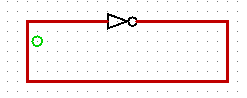
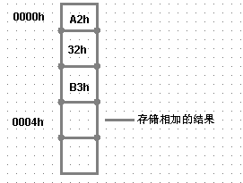

## 一、计算与电

数字如何与电相联系？

十进制数字行不通

### （一）乔治布尔

乔治布尔，1847年，《逻辑的数学分析》，逻辑代数（布尔代数）。集合

>金属可以导电
>
>铅是金属
>
>因此，铅可以导电

```PYTHON
M # 所有金属集合
P # 所有导电的东西集合

M * P = M  1

S # 铅集合
S * M = S  2

S * M * P = S => S * P = S
```

引入了集合，引入了交集、并集..，另外引入了数字1和0表示命题的真假。

```python
A = "今天会下雨"
A = 1 # 真

B = "今天会出太阳"
B = 1/0
```

A、B有4种情况

A    B    C

1    0     0

### （二）香农

20岁，《继电器和开关电路的符号化分析》，电路与逻辑进行关联。

## 二、加法器设计

```python
5+6  --> 101 + 110
```

   1100

+0100

 10 0 00

二进制的每一位都可以使用开关来进行构造，所以 `101`可以使用三个开关，`110`可以使用三个开关。


完整的加法电路：


## 三、门电路

### （一）基本门电路

- 与门


`Z=X*Y`

| X    | Y    | Z    |
| ---- | ---- | ---- |
| 0    | 0    | 0    |
| 0    | 1    | 0    |
| 1    | 0    | 0    |
| 1    | 1    | 1    |

- 或门


`Z=X+Y`

| X    | Y    | Z    |
| ---- | ---- | ---- |
| 0    | 0    | 0    |
| 0    | 1    | 1    |
| 1    | 0    | 1    |
| 1    | 1    | 1    |

- 非门


`

| X    | Z    |
| ---- | ---- |
| 0    | 1    |
| 1    | 0    |

### （二）扩展门电路

通过上面的基础电路，可以组成与非、或非、异或等电路。

- 与非 = 非X\+非Y
- 或非 = 非X\*非Y
- 异或 = 非X\*Y+X\*非Y

**与非**

| X    | Y    | Z    |
| ---- | ---- | ---- |
| 0    | 0    | 1    |
| 0    | 1    | 1    |
| 1    | 0    | 1    |
| 1    | 1    | 0    |

**或非**

| X    | Y    | Z    |
| ---- | ---- | ---- |
| 0    | 0    | 1    |
| 0    | 1    | 0    |
| 1    | 0    | 0    |
| 1    | 1    | 0    |

**异或**

| X    | Y    | Z    |
| ---- | ---- | ---- |
| 0    | 0    | 1    |
| 0    | 1    | 1    |
| 1    | 0    | 1    |
| 1    | 1    | 0    |

### （三）电路符号


### （四）加法器实现


011 + 111 = 

| A    | B    | CI   | S      | CO   |
| ---- | ---- | ---- | ------ | ---- |
| 1    | 1    | 0    | 0      | 0    |
| 1    | 1    | 0    | 1      | 0    |
| 1    | 1    | 0    | 1（0） | 1    |

## 四、触发器与振荡器

5+6+7

- 怎么保存前两个数相加的和
- 怎么让电路一直运行下去，继续读取下个数的二进制值

#### 1、触发器

**或非**

| X    | Y    | Z    |
| ---- | ---- | ---- |
| 0    | 0    | 1    |
| 0    | 1    | 0    |
| 1    | 0    | 0    |
| 1    | 1    | 0    |


关闭上面的开关：


- 闭合上面的开关灯点亮，当再断开，灯依旧亮
- 闭合下面的开关灯熄灭，当再断开，灯依旧熄灭

这种电路拥有记忆功能，这种电路是存储的本质。

#### 2、振荡器

就是在0和1之间不断的跳动，本质就是一个非门：



振荡器，也被称之为时钟。


0.06，倒数， 1/0.06 = 17  赫兹  17HZ

2.9GHZ 主频  主频越高 读取数据越快

时钟与处理数据有关


上面这种每次存一位二进制的电路叫做锁存器。多个锁存器连接起来就是多位存储器。

## 五、字节与十六进制

0、1二进制作为电路中的数据流，总该有一个计量单位。专业术语。

一个二进制--》一个比特 bit

8bit --> 1个字节 Byte

1B = 8b  

1kb = 1024B

字节8位  00000000-11111111 十进制 0-255

使用频率高，找简洁方式进行表示。

八进制 0-7   000-111

11 110 110  二进制

3    6      6

00000000-11111111  # 000-377


如果16位二进制 

```python
1 011 001 111 000 101 # 二进制
1  3   1   7   0   5  # 八进制
```

不过16位二进制明显是2个字节，如果分别计算每一个字节的话：

```python
10 110 011      11 000 101 # 二进制
2   6   3        3  0   5  # 八进制
```

多字节值与分开的单字节值不一样


```python
1011 0011 1100 0101 # 二进制
B    3    C    5    # 十六进制
```

分开计算每一个字节：

```python
1011 0011      1100 0101
```

## 六、存储器

### （一）基本概念

对锁存器进行简化：


为了画起来方便，可以将时钟命名为操作端（Write），数据端是数据输入（Data In）命名为DI，右侧为数据输出端（DataOut）命名为DO

多位锁存器可组成的存储器：


### （二）数据存储过程

现在我们需要思考的是如何将数据存入到上面的四个锁存器中，那么需要考虑的如何确定锁存器的位置，显然两位二进制的数就可以表示出四个位置，所以现在就是设计一个电路然后确定每一个锁存器的位置，这个电路有2个输入端口（s0, s1），4个输出端口（O0, O1, O2, O3），这个电路我们可以称之为地址译码器，专门用于寻址用的：


对于输入和输出：

| S0   | S1   | O0   | O1   | O2   | O3   |
| ---- | ---- | ---- | ---- | ---- | ---- |
| 0    | 0    | Data | 0    | 0    | 0    |
| 0    | 1    | 0    | Data | 0    | 0    |
| 1    | 0    | 0    | 0    | Data | 0    |
| 1    | 1    | 0    | 0    | 0    | Data |

所以，我们可以理解每一位锁存器有对应的地址：


根据上面的结构我们就可以将每一位数存入到对应的每一个单元格中。

### （三）数据取出过程


上述锁存器组成的存储器叫做随机访问存储器（Random Access Memory），简称RAM

简化：


### （四）多位存/取

将上面的RAM进行不同的组合：


简化：


组合后的RAM阵列依旧存储的二进制数是4个，但是位宽是2，也就是说它同时可存、取的二进制数是2位。

### （五）数据计算

1 + 2 + 3

存 + 计算（加法器） = 累加器



- 把0000h的数据加载到累加器中
- 把0001h的数据加载到累加器中
- 把0002h的数据加载到累加器中
- 把累加器中的数据存储在0003h中
- 令自动加法器停止工作

可以使用代码来标记上面的操作：

| 操作码        | 代码 |
| ------------- | ---- |
| Load（加载）  | 30h  |
| Store（保存） | 12h  |
| Add（加法）   | A6h  |
| Halt（停止）  | F6h  |

于是我们可以简写成：


## 七、冯•诺依曼模型

构成：

- 存储器
- 运算单元（算术逻辑单元）
- 控器单元
- 输入
- 输出

与之前所说进行对应：

- 多位锁存器组成的存储器--》存储器
- 算术逻辑单元--》加法器、累加器
- 控制单元--》地址译码器、地址选择器

运算器：处理数据、完成各种算术运算

控制器：分析地址

存储器：存储程序和数据


