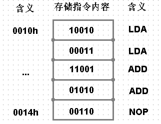
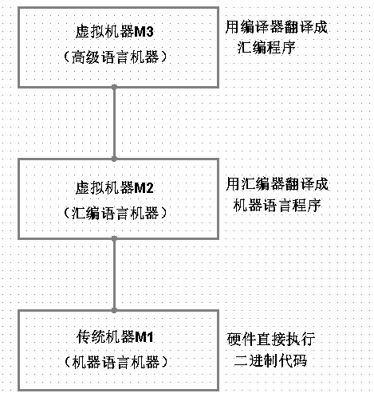
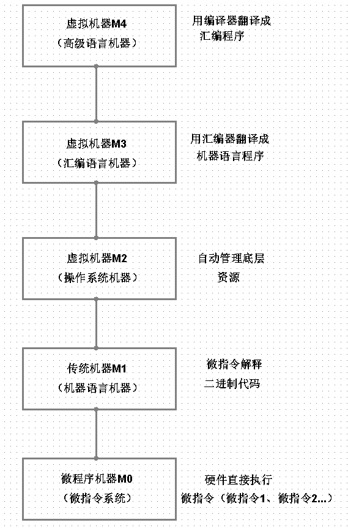

## 一、微处理器


Load、Add、Store、Halt指令性的操作，计算机是如何取识别这些指令并且进行具体的操作呢？

微处理器：将计算机的中央处理器（CPU）的所有组件整合在一起，集成在一个硅芯片上。它执行的就是控制器和运算器的功能。

我们所熟悉的处理器由Intel的，比如：

- 赛扬（Celeron）——桌面低端
- 奔腾（Pentium）—— 桌面中端
- 酷睿 (Core)——桌面高端
- 至强（Xeon）——服务器中端
- 安腾（Itanium）——服务器高端
- 凌动（Atom） ——移动平台

都是Intel不同系列的处理器，具体系列的处理器如：

- Intel Xeon E5-2687W @ 3.10GHz 
- Intel Core i7-3970X @ 3.50GHz
- Intel Core i7-3615QM @ 2.30GHz
- ...

intel在1947年，8080处理器有16个用于寻址的输出信号（A0-A15）。8080是一个8位处理器一次性写入或读出8位数据（D0-D7）。

## 二、存取指、令

对于像Load、Add、Store、Halt这样一些指令，以及操作，可以进行组合，写成助记符的方式

- 把0000h的数据加载到累加器中

```python
LDA A, [0000h] # LDA A表示加载到累加器  0000h表示16位的存储地址，通常使用4个16位进制数表示
```

- 把0001h的数据加载到累加器中

```python
LDA A, [0001h]
```

- 把0002h的数据加载到累加器中

```python
LDA A, [0002h]
```

- 把累加器中的数据存储在0003h中

```python
STA [0003h], A 
```

- 令自动加法器停止工作

```python
NOP
```

每一款CPU的助记词不同，8080 CPU助记词:

| 操作码 | 指令             | 含义                                         |
| ------ | ---------------- | -------------------------------------------- |
| 32     | LDA  A , [0000h] | 把0000h的数据加载到累加器中                  |
| 3A     | LDA A, [0003h]   | 把0002h的数据加载到累加器中                  |
| 80     | ADD A, B         | 累加器中A的值（23h）与累加器中B的（12h）相加 |
| A0     | AND A,B          | 逻辑与运算                                   |
| 00     | NOP              | 处理器什么指令也不执行                       |

执行指令，首先先要存、取：



上面指令写的一些代码，就是汇编语言。

存取的指令内容，就是机器码。

汇编--》机器码  之间有一个桥梁，用来转化，类似一张表，每一个指令对应一个机器码，比如：

```python
ADD AX,BX   100100 # 寄存器到寄存器
ADD AX,[0000h]   100101 # 存储器到寄存器
ADD AX, 1000   100111 # 立即值到寄存器
...
```

这种对应关系，你可以称之为汇编器。

## 三、高级语言

汇编：无移植性

c语言，可以移植



## 四、计算机系统五层结构

### （一）微指令

我们由硬件直接执行的二进制代码是由汇编语言得到的，如：

```python
# 汇编语言
LDA A, [0001h]
LDA A, [0002h]
...

# 机器代码
0000,1100,1010,01010000,
0000,1100,1010,01010000,
...
```

但是显然有的指令是可以合在一起进行重复使用的，这样可以将机器代码对应的进行合在一起从而提高执行效率：

```python
0000,1100,1010,01010000, # 合在一起形成一条微指令
0000,1100,1010,01010000, # 合在一起形成一条微指令
```

所以上面的就是2条微指令，如果下次还有相同的一系列指令构成的微指令，直接执行即可。

### （二）操作系统

```python
# 汇编语言
mov [512Ch]，bx # 将一个寄存器中的数据送入内存单元512Ch中
mov [512Ch]，ax
```

- 自己管理地址
- 记住存储器的大小

自己手工释放资源，操作系统应运而生（文件管理、内存管理、硬件接口...）

### （三）五层结构




