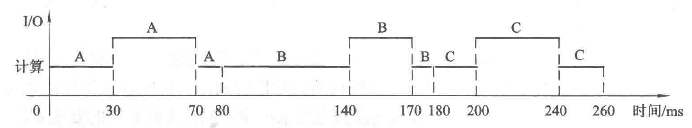
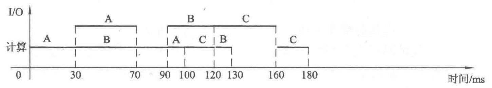
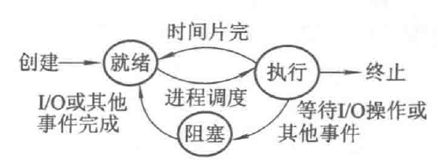

## 一、单道批处理系统

一个接一个的处理任务：A、B、C

那么如何解决这种问题呢？

## 二、多道批处理系统

为了进一步提高系统利用率和系统吞吐量。

- 多道技术

在内存中装有若干道程序（作业）、这样便可以在运行程序A时，利用其因I/O操作而暂停执行的CPU空挡时间去调度另一道程序。

## 三、并行与并发

- 并行性 两个或多个事件在同一时刻发生
- 并发性 两个或多个事件在同一时间间隔内发生

并行至少2个cpu

## 四、进程

- 进程是程序的一次执行
- 进程是一个程序及数据在处理机上顺序执行时发生的活动

进程是一个动态过程。

由于多个进程在并发执行时共享系统资源，致使他们再运行过程中呈现间断的运行规律，所以进程在其生命周期内可能具有多种状态，一般而言，每一个进程至少应处于以下三种状态之一：

- 就绪（Ready）状态。进程已处于准备好运行的状态，即进程已分配到除CPU以外的所有必要资源后，只要再获得CPU，便可立即执行
- 执行（Running）状态。进程已获取CPU，其程序正在执行的状态
- 阻塞（Block）状态。这是指正在执行的进程由于发生某事件（如I/O请求*申请缓冲失败等）暂时无法继续执行的状态，亦即进程的执行受到阻塞

进程调度：

执行：

- 资源准备（内存、CPU）
- 最小的执行单位

## 五、线程

在引入线程后，在调度性，并发性，拥有资源，独立性，系统开销，支持多处理机系统层面上都有变化：

- 线程作为调度和分派的基本单位，因而线程是独立运行的基本单位，当线程切换时仅需保存和设置少量寄存器内容，切换代价低于进程。
- 引入线程的OS中，不仅进程可以并发执行，而且同一进程中的不同线程之间也可以并发执行
- 进程作为资源的最小分配单位，同一个进程中的线程共享该进程的资源
- 同一进程中的不同线程之间的独立性要比不同进程之间的独立性低很多，不同进程之间不能进行互相访问，而同一个进程中的不同线程之间共享同一进程的所有资源

同样的线程在运行时，也与进程一样拥有三个状态：

- 就绪（Ready）状态。进程已处于准备好运行的状态，即进程已分配到除CPU以外的所有必要资源后，只要再获得CPU，便可立即执行
- 执行（Running）状态。进程已获取CPU，其程序正在执行的状态
- 阻塞（Blcok）状态。这是指正在执行的进程由于发生某事件（如I/O请求，申请缓冲区失败等）暂时无法继续执行的状态，亦即进程的执行受到阻塞

## 六、同步与异步

一个进程是另一个进程的后序（一个进程依赖另一个进程），那么当前进程的执行，必须要等到另一个进程执行完毕才能执行，这样有顺序的执行进程就是同步。

异步就是当一个进程碰到I/O等操作时，CPU可以执行其它进程，当第一个进程执行I/O操作后可以接着被执行，显然这两个进程具有并发的特性。

因此，同步就是进程之间具有前后关系，后一个进程必须利用到先前进程的结果，是不能并发执行的；异步是进程之间可以进行并发执行。

