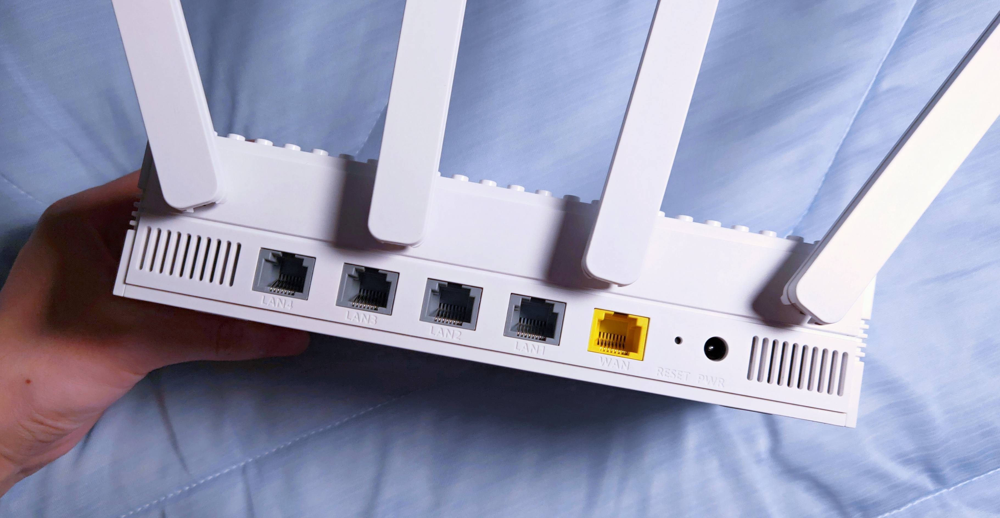
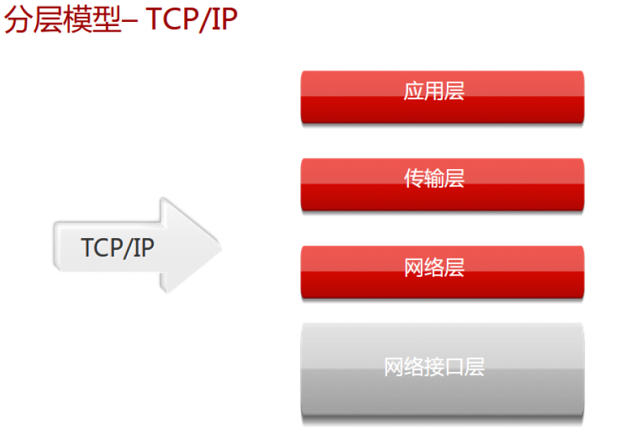
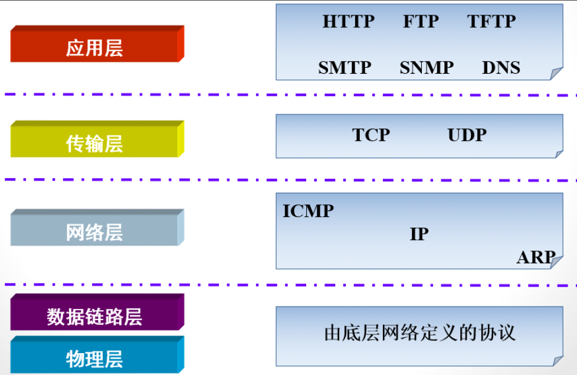

## 一、网络架构

网络普遍应用于各行各业当中，包括小型办公室、教育、政府和银行等机构中。

网络远程互联：

网络不受地域限制，可以通过各种远程互连技术把分布在不同物理地域的网络连接在一起。

网络基本架构：

## 二、网络基础

硬件方面：通过介质将网络设备和终端连接起来

软件方面：操作系统，应用软件，应用程序互相通讯

实现资源共享、信息传递

### （一）硬件层面

对于硬件层面，路由器、交换机、网线、光纤

路由器：

交换机：

网线：

光纤：

光纤是光导纤维的简写，是一种由玻璃或塑料制成的纤维，可作为光传导工具。

### （二）软件层面

在网络通信过程中，发送方与接收方除了必备的硬件方面还需要的就是决定数据的格式和传输的规则，这就是协议。

而这些协议栈位于操作协同的底层，另外就是通过微信、QQ等聊天，浏览器上网这些等都是软件。

## 三、网络模型

我们主要是把重心放在软件层面，尤其是协议栈上，学习网络其实就是在学习各种协议，在学习协议过程中使用分层的思想进行学习。

将复杂的流程分解为几个功能相对单一的子过程

- 流程更加清晰，复杂问题简单化
- 更容易发现问题并针对性的解决问题

在网络中也是如此。

### （一）OSI模型

Open System Interconnect，开放系统互连参考模型，由ISO（国际标准化组织）定义。

此为osi七层网络模型。

但是商业化使用的是四层模型（TCP/IP）

### （二）TCP/IP模型

### （三）模型发展

TCP/IP开发先于OSI，最终在市场上获得认可，目前所有厂商支持并使用。

所以我们着重学习TCP/IP四层网络模型。

## 四、TCP/IP四层网络模型

### （一）TCP/IP协议簇中的常见协议

对于任意的一个数据包包含很多协议，比如以太网、IP、TCP协议等。

这些协议都被分成在每一层中：

### （二）应用层

最上层的，也是我们能直接接触到的就是**应用层**（*Application Layer*），我们电脑或手机使用的应用软件都是在应用层实现。那么，当两个不同设备的应用需要通信的时候，应用就把应用数据传给下一层，也就是传输层。

所以，应用层只需要专注于为用户提供应用功能，比如 HTTP、FTP、Telnet、DNS、SMTP等。

应用层是不用去关心数据是如何传输的，就类似于，我们寄快递的时候，只需要把包裹交给快递员，由他负责运输快递，我们不需要关心快递是如何被运输的。

而且应用层是工作在操作系统中的用户态，传输层及以下则工作在内核态。

#### 1、DNS协议

Domain Name System，域名解析系统。

- 建立IP地址与域名之间的映射关系
- 将域名解析为IP地址
- 将IP地址解析为域名

>ipconfig /displaydns   查看DNS缓存
>
>ipconfig /flushdns      清空DNS缓存

[域名实验](https://www.cnblogs.com/shenjianping/p/16801296.html)

[ensp安装](https://blog.csdn.net/ll945608651/article/details/128813014)